# Assignment and Exam

## Introduction

2016-AS1-1

2015-AS1-1

2014-AS1-1

2013-AS1-1

2012-AS1-1

Search in the news an article about privacy violations. Describe briey the reported incident anddiscuss its privacy implications (at most half page). The reference to the article should be given.

## Discretionary Access Control

Homework-DAC

2016-AS1-2-HUR

 

2016-AS1-6-Take-grant-HRU

* Describe the Take-grant access control model. Discuss the main differences between the Take-grantmodel and the Harrison-Ruzzo-Ullman model.

2015-AS1-2-HUR

 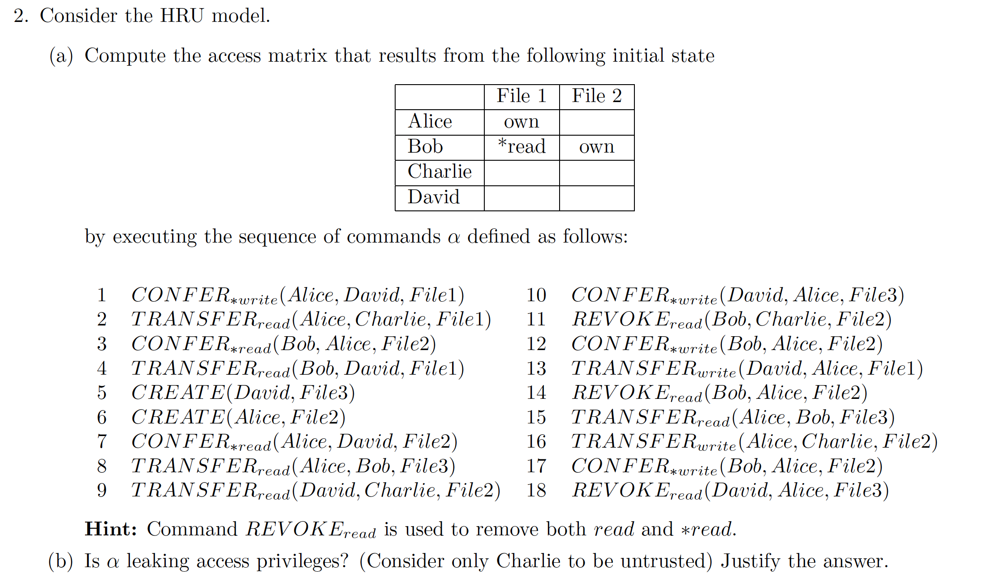

2015-s-AS1-2

 

2015-EX1-1-HUR

 

2014-AS1-2-HUR

 

2014-AS1-6-Take-grant-HRU

* Describe the Take-grant access control model. Discuss the main differences with the Harrison-Ruzzo-Ullman model.

2014-EX1-1-Take-grant-HRU

 

2014-EX2-1-command

 

2013-AS1-2-command

 

2013-AS1-6-accesscontrol-SELinux

* Describe the access control system used in SELinux.
* https://access.redhat.com/documentation/en-US/Red_Hat_Enterprise_Linux/6/html/Security-Enhanced_Linux/chap-Security-Enhanced_Linux-Introduction.html

2013-EX1-1-HUR

* Explain the safety problem in Harrison-Ruzzo-Ullman Model. State under which condition(s)the safety problem is decidable.

2013-EX2-1-command

 

2012-AS1-2-HUR

 

2012-AS1-3-accessmatrix

 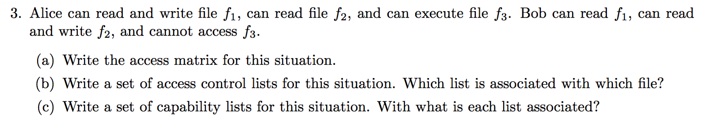

2012-EX1-1-HUR

 
 
 

## Mandatory Access Control

homework

 

2016-AS1-3-Biba-low-watermark

 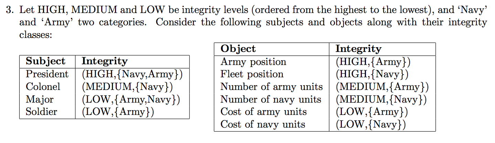

 

2016-AS1-4-ChineseWall

* Show how the principles underlying Chinese Wall can be modeled in multilevel security.

2015-AS1-3-BLP

 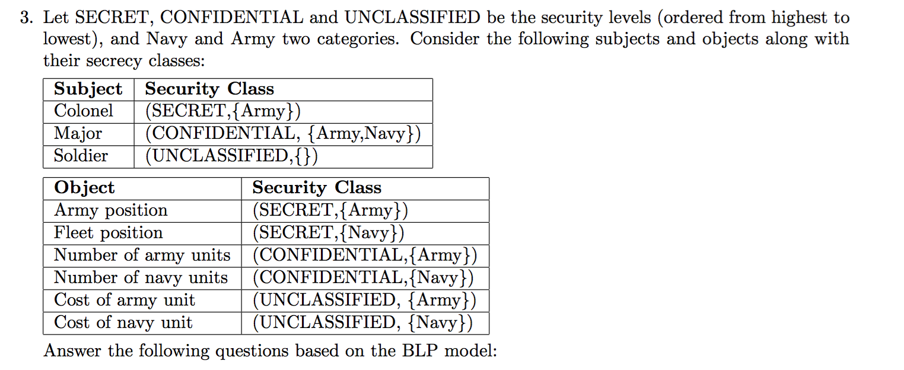

 

2015-s-AS1-3

 

 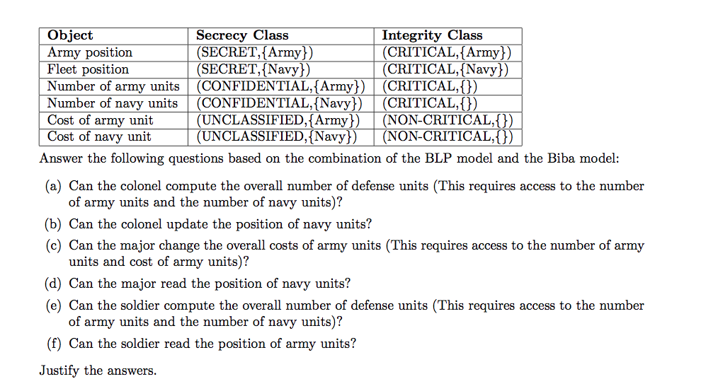

2015-AS1-4-ChineseWall-BLP

* Discuss the possibility of defining a Chinese Wall policy in the BLP Model.

2015-S-AS1-6

* Describe the access control system used in FreeBSD.
* https://www.freebsd.org/doc/handbook/mac.html
* RBAC

2015-AS1-6-ClarkWilson-Biba

* Describe the Clark-Wilson integrity model. Discuss the main differences between this model and theBiba model.
* http://security1.win.tue.nl/~zannone/teaching/CS4080/Material/sam-fosad.pdf

2015-EX2-1-Biba-low-watermark

 

2015-EX2-2-ChineseWall

* Explain the goal of the Chinese Wall model and describe the main concepts and properties of the model.

2014-AS1-3-lattice-lub-glb

 

2014-AS1-4-ChineseWall

 

2014-EX1-2-BLP-Biba

 

2013-AS1-3-BLP

 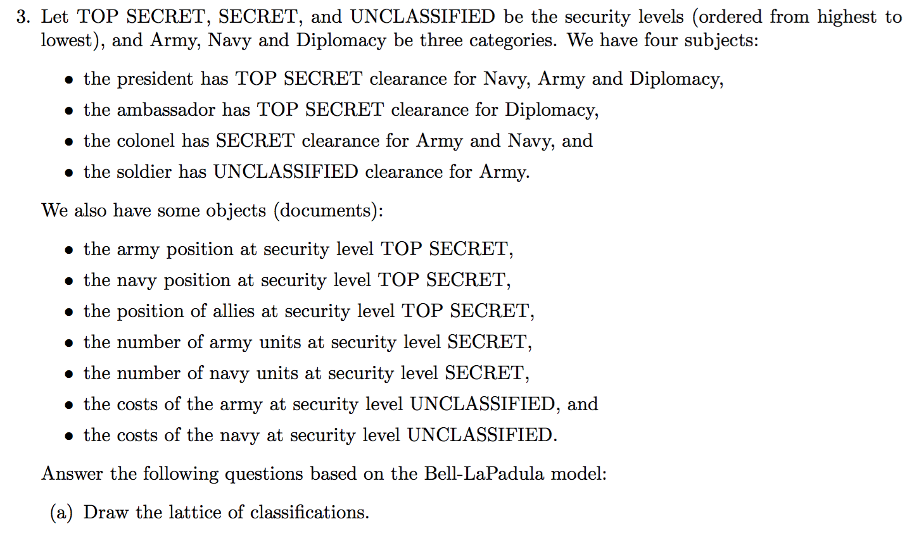

 

2013-AS1-4-ChineseWall-BLP

* Define a construction to emulate the Chinese Wall model using BLP model. Discuss the limitations(if any) of the construction.

2013-EX1-2-Biba

 

2013-EX2-2-BLP-Biba

 

2012-AS1-4-ChineseWall-BLP

* Define a construction to show that a system implementing the Chinese Wall model can support the BLP Model.

2012-EX1-2-ChineseWall-BLP

* Describe the main differences between the Bell-LaPadula model and the Chinese Wall model.

2012-EX2-1-BLP

 

2012-EX2-2-BLP-Biba

* Describe the Bell-LaPadula and Biba models and how these two models can be combined.

## Role Based Access Control

Homework

no

2016-AS1-5-RBAC3

 

2015-s-AS1-4

 

2015-s-AS1-5

 

2015-AS1-5-RBAC3

 

2015-EX2-3-RBAC3

 

2014-AS1-5-RBAC3

 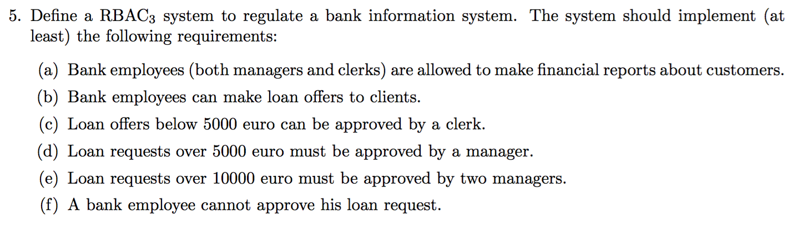

2014-EX2-2-RBAC3

 

2013-AS1-5-RBAC3

 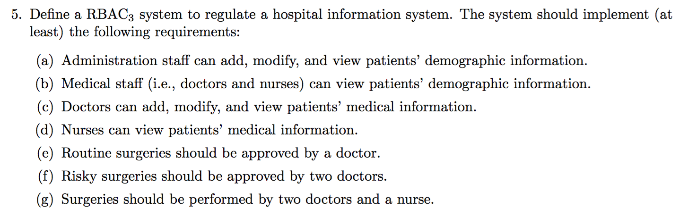

2012-AS1-5-RBAC3

 

 

2012-AS1-6-SSD-dsd

 

2012-AS1-7-DAC_MAC_RBAC

 

2012-EX1-3-RBAC3

 
 ## Usage Control

Homework

2016-AS2-1

2015-AS2-1

2014-AS2-1
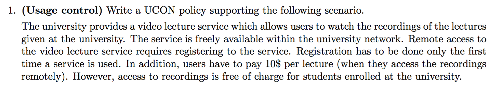

2014-EX1-5-UCON-Bibalowwatermark

* Represent the Biba model with low-water mark for subjects in the UCON model.

2014-EX2-4

* List and explain the decision properties in UCON. Decribe how they are modeled in the language.

2013-AS2-1

2013-EX2-4
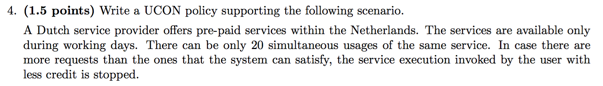

2012-AS2-1

2012-EX2-3

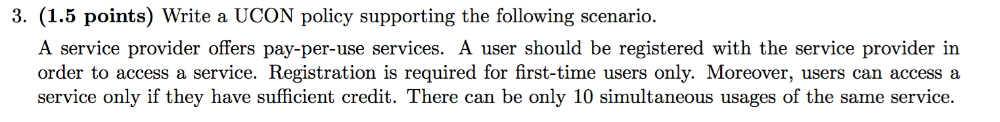
 
## Introduction to Privacy

2015-EX1-3-ReputationBasedTrustManagement-RuleBasedTrustManagement

2014-EX1-4-TrustNegotiation

2013-EX1-4-ReputationBasedTrustManagement-RuleBasedTrustManagement

2013-EX2-5-datacentric-linkcentricprotection

2012-EX2-6-confidentialityattransport
 
 
 ## Privacy-aware Access Control 1

Purpose-based Access Control

Homework

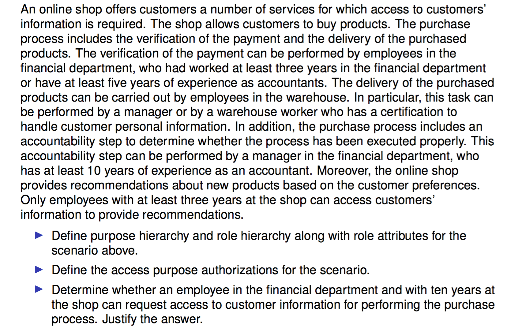

2016-AS2-2

 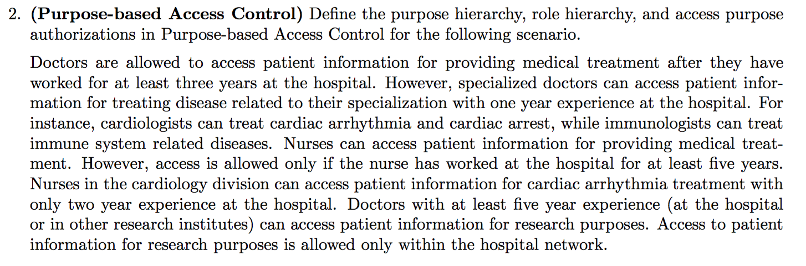

2015-s-AS2-2
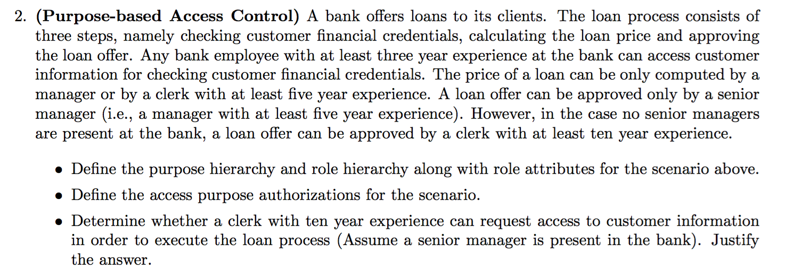

2015-AS2-2

 

2014-AS2-2

 

2014-EX2-5

 

2013-AS2-2

 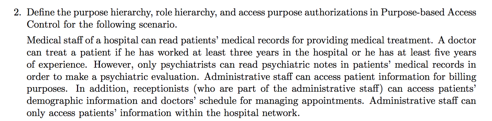

2013-EX1-5

 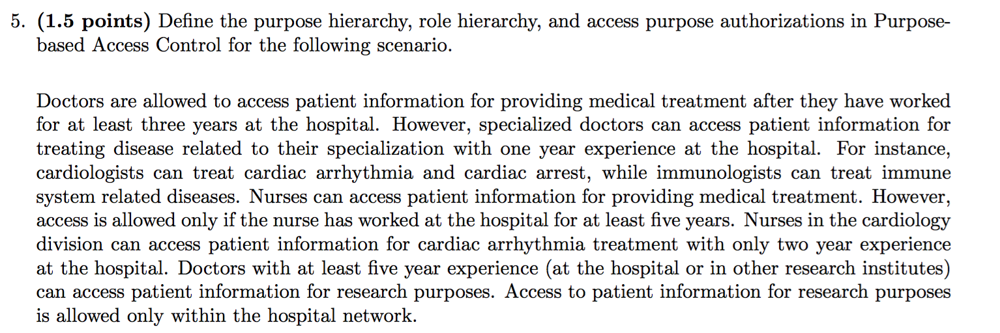

2012-AS2-2

 

2012-EX1-5-accesspurposeverification

* Describe the access purpose verification in Purpose-based Access Control.
* 

## Privacy-aware Access Control 2
Homework

2016-AS2-3-EPAL

2015-AS2-3-EPAL
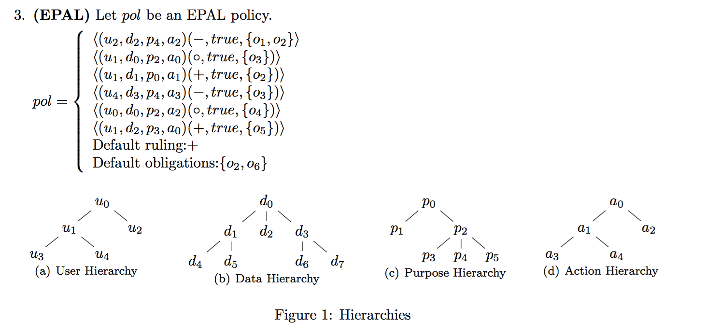
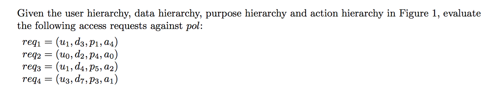
2015-s-AS2-3

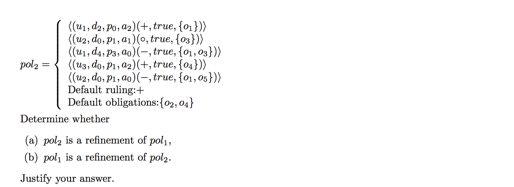
2015-EX1-4-EPAL

2015-EX2-5-EPAL

2014-AS2-3-EPAL

2014-EX1-6-EPAL

2013-AS2-3-EPAL

2013-EX1-6-EPAL

2012-AS2-3-EPAL

2012-EX2-4-EPAL
## eXtensible Access Control Markup Language(XACML) 1

## eXtensible Access Control Markup Language(XACML) 2

2016-AS2-4

2015-AS2-4

2015-EX1-6

2015-EX2-6

2014-AS2-4

2014-EX1-7

2014-EX2-6

2013-AS2-4

2013-EX1-7

2013-EX2-6

2012-AS2-4

2012-EX1-6

2012-EX1-7-RABC1-XACML

2012-EX2-7

## Reduction of Access Control Decisionss

2015-EX1-5-D3-D7

## RT

2015-EX1-2-RT0

2015-EX2-4-RT0

2014-EX1-3-RT0

2014-EX2-3-RT0

2013-EX1-3-RT0

2013-EX2-3-trustmanagementlanguageRT

2012-EX1-4-RT0

2012-EX2-5-RT

