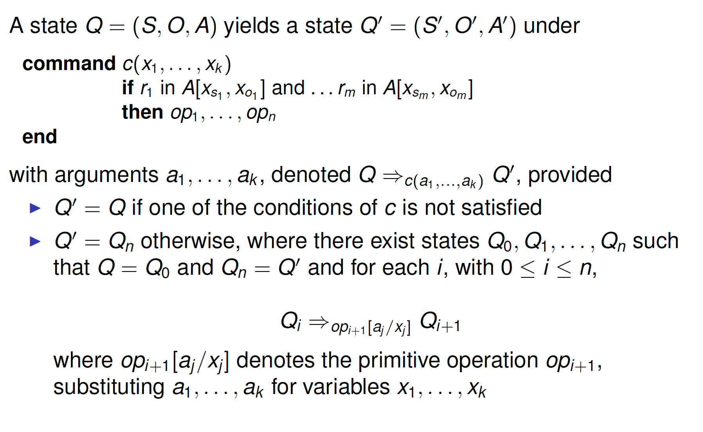
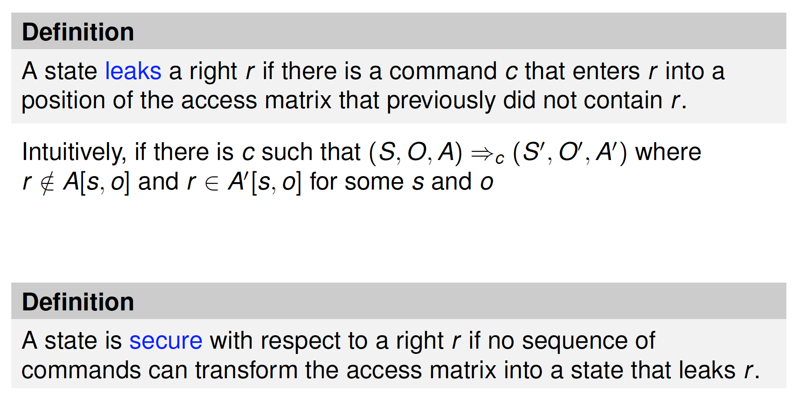
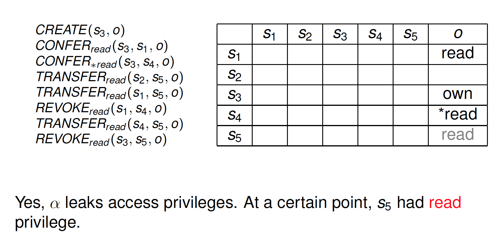
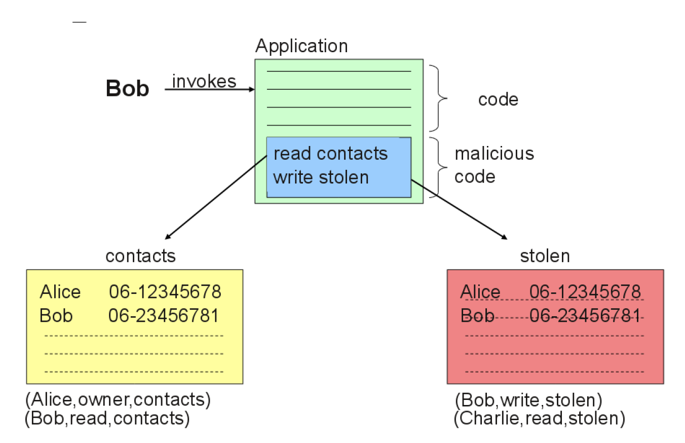

# Discretionary Access Control

##Outline
- Access Control
- Discretionary Access Control
- Safety Problem
- DAC weaknesses

##Access Control

###Computer Security Objectives
- Confidentiality
  - Information disclosed only to principals authorized to know it
  - Privacy:
    - right to be let alone (Warren and Bradeis, 1890)
    - right of the individual to decide when, what, why and who manage his personal information (Westin, 1970) 
    - freedom from unreasonable constraints on the construction of one’s own identity (Agre, 1999)
- Integrity
  - Information modified only by authorized principals and in the authorized ways
- Availability
  - Information accessible when it is needed (No denial of service)
###Access Control
- Goal: Protect confidentiality and integrity of information
- Control what a subject can do to prevent damage to the system
- Regulate the **operations** that can be executed by a **subject** on **data and resources**
- Typically provided as part of operating systems and of database management systems
  
- The basic idea of access control is that there is an _active_ subject requiring access to a _passive_ object to perform some specific access operation
- A _reference monitor_ grants or denies access

###Subjects
- Active entity performing operations in the system
- Subjects can be classified into:
  - users: single individuals connecting to the system
  - groups: sets of users
  - roles: a function or a position within a organization
  - processes: executing programs on behalf of users
- Relations may exist among the various types of subject

###Objects
- Any system resource (file, printer, etc.)
- _Protection objects_: objects controlled by access control system
- Note: not all resources managed by a system need to be protected
- **Advanced Objects: subjects**

###Access Rights
- Operations that a subject can execute on protection objects
- Each type of operation corresponds(相符合, 相一致;相当, 相类似;通信) to an _access_ right
  - access control must be able to control the specific type of operation
- The most simple example of access rights is:
  - read: look at the contents of an object
  - write: change the contents of an object
- Other types of rights depending on the resources to be protected
  - execute, select, insert, update, delete, etc.
- Advanced Rights: ownership, delegate(代表, 代表团成员;vt. 任命或委派…为代表;托付), remove

###Subjects, Objects, Access Rights in Unix
Subjects: users, groups
Objects: files, directories
Access rights: read, write, execute

- For files
  - read: reading from a file
  -  write: writing to a file
  -   execute: executing a (program) file
- For directories
  - read: list the files within the directory
  - write: create, rename, or delete files within the directory
  - execute: enter the directory

###Access Control vs. Authentication
Completely different things
 
Authentication: Establishing who you are(whether a user possesses a certain pseudonym/attribute or not)

Access Control: Establishing if a user has the right of doing a certain operation

Authentication is necessary for access control

###Policies, Models, Mechanisms

**Policy**: define (high-level) guidelines and rules describing the accesses to be authorized by the system
 
**Model**: formally define the access control specification and enforcement

**Mechanism**: implement the policies via low level (software and hardware) functions

###Separation between policies and mechanisms

Discuss access requirements **independently** from their implementation

**Compare** different access control policies as well as different mechanisms that enforce the same policy

Design mechanisms able to **enforce multiple policies**

###Security policies
- Access control policies: define who can access a resource
  - Discretionary(DAC)
  - Mandatory(MAC)
  - Role-based(RBAC)
  - Attribute-based(ABAC)
- Administrative policies: define who can specify access control policies
  - Usually coupled with DAC, RBAC and ABAC

##Discretionary Access Control (DAC)
- Intuitions:
  - The owner of a resource decides who can access it
  - Access rights can be delegated to other users
- Intended Environment:
  - Operating systems in the late 60s
  - Users are members of the same community: objective is to protect data from mistakes of others(cd/; rm-fr *)
  - Currently the most used in corporate environments
    >The basis for DAC is that an individual user (or program on its behalf) is allowed to specify explicitly the types of access other users (or programs on their behalf) may have to information under the user’s control ------NCSC (National Computer Security Center)
- Entities:
  - Subjects: who have privileges and can do operations on objects
  - Objects: files, resources, programs
  - Access Rights: what a subject can do on a object
- Main features
  - Ownership: Users have all the rights about the objects they create
    - when users create objects, they own them
  - Delegations: Users can give certain rights to other users
    - users can grant rights they have, to others
    - users that have control can remove rights

###DAC Models
- Take-grant model
- **Lampson(1974)**
- Graham-Denning(1972)
- **Harrison-Ruzzo-Ullman(1976)**
- Griffiths-Wade(1976)
- Originator control(1989)

###Lampson: Access Matrix
- Set of **subjects** S
- Set of **objects** O
  - subjects can be considered as objects, i.e., S ⊆ O
- **Access Matrix** A(S × O)
  - Entries contain sets of rights
    - access rights: read, write, call, etc.
    - administration rights: own, control
    - delegation rights: flags"*" and "+"

####Sample Access Matrix 

- “own” can add any rights
- “control” is the right to remove rights from a subject (in Lampson’s work, in other models ownership includes control)
- “*” flag can delegate rights to other subjects

####Q&A 

control: S1 can remove any right of S2

*read: S1 can give any subject the right to read F1

own: S3 can give any right on F2 to every subject

####Access Matrix: Implementation
- Matrix is generally **large** and **sparse**
  - Storing the entire matrix is waste of memory space
- Alternative approaches
  - **Authorization table**: store table of non-null triples(s,o,a)-->used in DBMS
  - **Access control lists(ACLs)**: Stored by column
  - **Capability lists**: Stored by row

####Authorization table

####Access control lists vs. Capability lists

Access control lists 
- Objects are the starting point (per-object basis)
- Require authentication of subjects
- Superior for access control and revocation on per-object basis
  Capability lists
- Subjects are the starting point (per-subject basis)
- Require control of propagation of capabilities
- Superior for access control and revocation on per-subject basis
  The per-object basis usually more convenient
  Most systems based on ACLs

###Harrison-Ruzzo-Ullman (HRU) Model

Define authorization system
- State(S,O,A)
  - S set of subjects
  - O set of objects
    - subject can be considered as objects( i.e.,S ⊆ O)
- Access Matrix A(S × O))
  - rows correspond to subjects
  - columns correspond to objects
  - A[s,o] indicates the privilege of s on o
- **State transitions** described by commands
  - commands defined as sequences of primitive operations
  - **enter** _r_ into A[s,o], **delete** _r_ from A[s, o], **create subject** s' ,
    **destroy subject** s' , **create object** o' , **destroy object** o'

###Primitive operations

###Commands
Changes to the system state modeled by commands of the form

with r1,...,rm rights and op1,...,opn primitive operations
Examples:

###Transfer of privileges
Delegation of authority by attaching flags to privileges(e.g.,* copy flag, + transfer-only flag)
- copy flag(*): subject can transfer privilege to others
  
- transfer-only flag(+): subject can transfer privilege to others (and the flag on it), but he loses the privilege
  

###State transitions

###Exercise 

Write a command which allows a process p to create a new process q. where parent and child processes can signal (read/write) each other.

**command** spawn_process(p,q)

  create subject q

  enter own into A[p, q]

  enter r into A[p, q]

  enter w into A[p, q]

  enter r into A[q, p]

  enter w into A[q, p]

**end**

##Safety Problem

###Fundamental Questions
- How can we determine whether a system is secure? 
  - Need to define what we mean by a system being “secure”
- Is there a generic algorithm that allows us to determine whether a computer system is secure?

###Safety and Liveness

**Safety property**: nothing bad happens
- the program will never produce a wrong result (“partial correctness”)

**Liveness property**: something good eventually happens
- the program will produce a result (“termination”)

###Examples: 

C1: Whenever process P1 wants to enter the critical session, provided process P2 never stays in the critical session forever, P1 gets to enter eventually.

**Liveness**

C2: It cannot happen that both processes are in their critical sessions simultaneously.

**Safety**

###When is a systme secure?

A simple definition
- A system is secure if it does not allow violations of security policies

Alternative definition based on distribution of rights
- No leakage of rights

###Waht is a secure system?

###Exercise 

###HRU: Safety Problem
Safety problem: Given an initial state (S,O,A) and a right r , is there any sequence of commands leaking r?

###HRU and Safety: "Desired" leaks

Leaks are not necessarily bad
- A system that allows sharing will of course have many leaks
- Subjects can intentionally transfer (leak) their rights to other trustworthy subjects

Security for r can be considered by ignoring all trustworthy subjects (i.e., ignoring “desired” leaks)

###Exercise 

###Safety problem: Decidability

**Safety problem**: Given an initial state (S,O,A) and a right r , is there any sequence of commands leaking r?

Or does transfer of r violate security policies of the system?

Is there a generic algorithm that allows us to determine whether a computer system is secure?

###Safety problem: Some bad news

Theorem: Verifying the security of an access matrix A with respect to a right r is undecidable.

The problem can be reduced to the halting problem of a Turing machine

###Safety problem: Good news?
A **mono-operational system** is a system in which every command consists of a single operation

**Theorem:** Verifying the security of an access matrix A with respect to a right r is decidable in a mono-operational system.

Bad news
- Mono-operational systems are not useful
- If you create an object you cannot own it => you cannot modify it

**Remark:** Decidability can also be proved for systems with a finite number of subjects and objects, or for systems where it is not possible to create new subjects and objects.

##DAC weaknesses

DAC imposes constraints only on **direct** access
 
No control on the information once released
=> DAC is vulnerable to **Trojan horses**
- exploiting access privileges of calling subject

**Trojan horses**: a program (apparently harmless) which contains malicious or harmful code
###Trojan horses – Example

##Summary

**Access control**: regulates the operations that can be executed on data and resources to be protected

**DAC**: users can regulate the access to their resources
- Lampson
- HRU model

**Safety Problem**: Given a configuration Q and a right r , is there any sequence of commands that leaks r?
 
**DAC vulnerabilities**: Trojan horses

##References

B. Lampson. Protection. Proc. 5th Princeton Conf. on Information Sciences and Systems, Princeton, 1971. Reprinted in ACM Operating Systems Rev. 8(1):18–24. 1974. (obligatory)

M. A. Harrison, W. L. Ruzzo and J. D. Ullman. "Protection in Operating Systems". Communications of ACM. 19(8):461–471, 1976. (obligatory)

Pierangela Samarati and Sabrina De Capitani di Vimercati. Access Control: Policies, Models, and Mechanisms. In FOSAD’00. Springer-Verlag, 137-196. 2000. (suggested)

