# eXtensible Access Control Markup Language (XACML) Part 1

## What is XACML

XACML stands for eXtensible Access Control Markup Language

OASIS standard

XACML defines

* Language to express access control policies, access requests andresponses
  * Attribute-based access control policy languagE
  * Implemented in XML
  * Default attributes and functions
* Access decision process
  * how to evaluate a request against a policy
* High-level architecture (PEP, PDP, PIP, PAP, etc.)

### History

* OASIS Standard 
* XACML 1.0 (February 2003) 
* XACML 2.0 (February 2005)
* XACML 3.0 (January 2013)
  * XACML Core 
  * Privacy Policy Profile
  * Role Based Access Control
  * OASIS Security Assertions Markup Language (SAML) 
  * ...
* Implementations 
  * Sun Implementation (http://sunxacml.sourceforge.net/) 
  * Xengine (http://xacmlpdp.sourceforge.net/)
  * SAFAX (http://security1.win.tue.nl/safax/)
  * Many more at http://www.oasis-open.org/

### XACML Data Flow

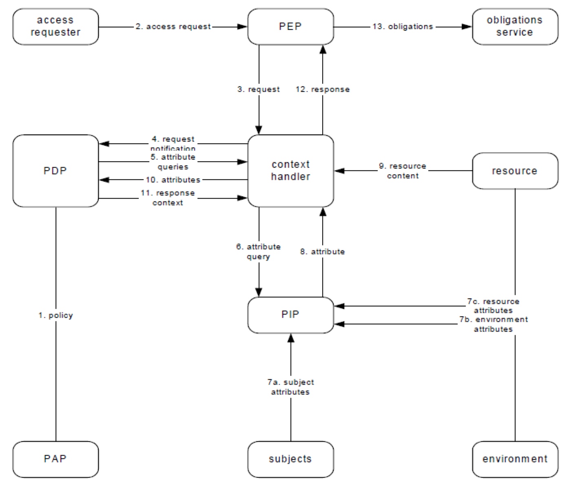

**Policy administration point (PAP)** creates a policy or policy set 策略管理点

**Context handler** constructs an XACML request context and sends it to the PDP 上下文处理器

**Policy decision point (PDP)** evaluates applicable policy and renders an authorization decision 访问控制策略决策点

**Policy enforcement point (PEP)** performs access control, by making decision requests and enforcing authorization decisions 访问控制策略执行点

**Policy information point (PIP)** that acts as a source of attribute values 访问控制策略信息点

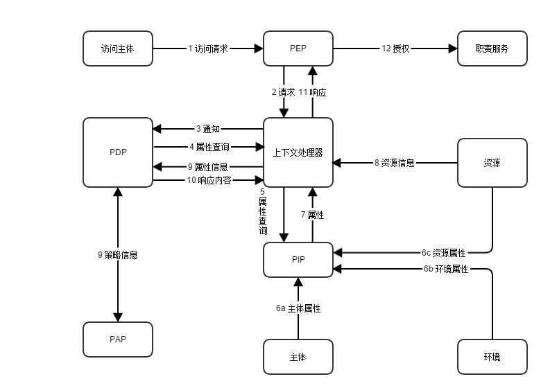

1. 访问请求发送给PEP，PEP获取请求中的主体、客体、环境、操作行为的属性，这些请求的信息传给上下文处理器Handler。
2. 上下文处理器Handler将请求转化封装成XML文本转发给PDP，PDP向Handler发送查询属性请求。
3. Handler将PDP发送过来的请求转发给PIP处理，PIP查找属性信息，把属性返回给Handler。
4. Handler获得属性信息后，将请求到属性信息转发给PDP。PDP结合策略管理点PAP提供的策略，执行策略。
5. 策略决策点PDP将授权决策的结果返回给上下文处理器Handler进行处理。
6. Handler把PDP返回的结果转换成PEP可以识别的格式，PEP根据返回的结果进行相应的处理。

## Outline

* Policy Language 
* Access Request
* Evaluation
* Response
* Exercise

## Policy Language
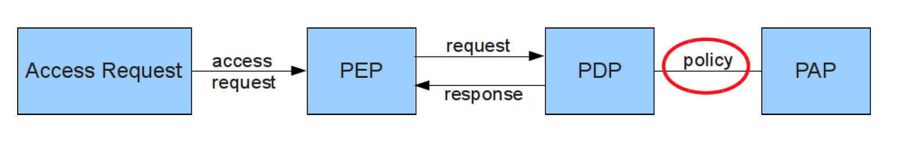

How to specify a policy?

### Attribute-Based Access Control (ABAC)

Attributes are (name,value) pairs

* values can be complex data structures

Associated with **subjects, actions, objects, contexts**

No fundamental difference between subjects, objects, actionsand other contextual information

### XACML Policy Language Model

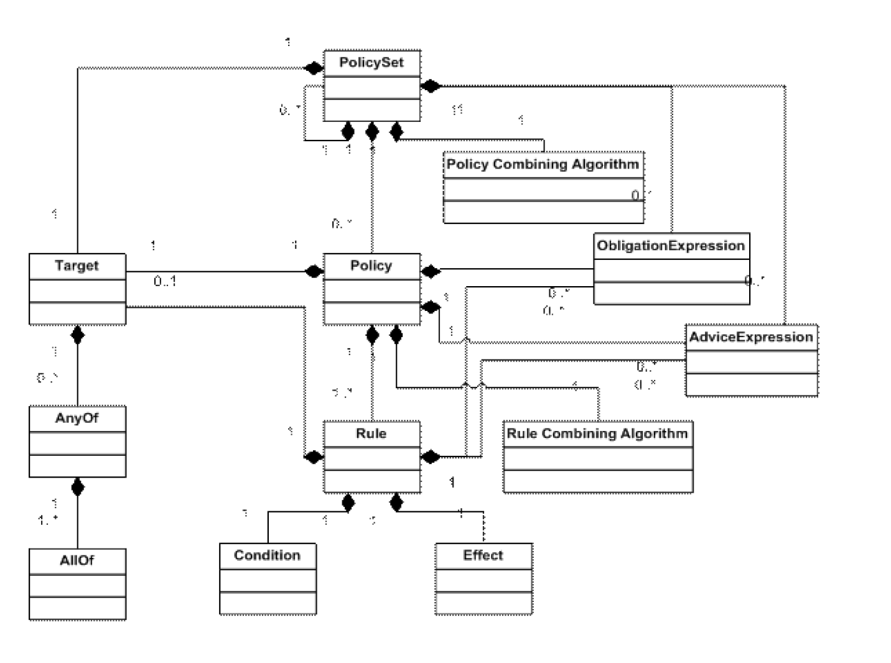

* **Target**: identifies which requests are applicable 目标：请求文件和策略文件都有，它由实体的属性构成。确定请求文件和策略文件匹配关系，如果匹配用该策略评估请求。
* **Effect**: Permit or Deny

  ​	属性: 用于描述实体(主体、客体、环境)的特性。
  ​	动作：主体对客体访问的操作
* **Rule**: returns an effect if the target matches 规则：进行授权判断，包含目标、动作、条件、结果。规则属于策略中的一部分，策略可以拥有多个规则。不同规则的判断结果可能不一致，需要规则组合算法协调最终的判断结果。
* **Policy**: composes several rules together 策略：策略由规则组合算法、目标，规则，义务等部分组成

  策略集：策略集包括多个策略或策略集，以及策略组合算法。
* **Condition**: defines additional constraints on the applicability of requests 条件：属于规则的一部分，用集合逻辑表达式描述授权条件。规则具有多个条件。
* **Obligation**: mandatory requirements to be satisfied 义务：策略判断后需要执行的操作。需要执行完所有的义务职责才能授权，执行义务职责出错就不会授权。

 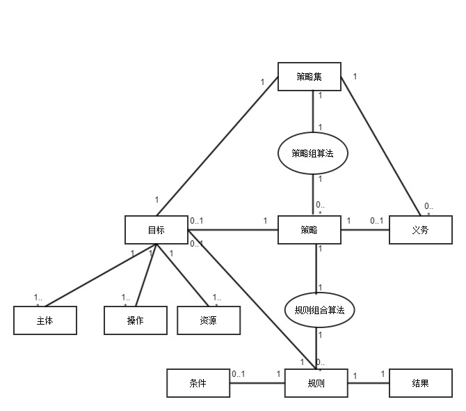

### ⟨Target⟩, ⟨AnyOf⟩, ⟨AllOf⟩, ⟨Match⟩

**⟨Target⟩** contains a conjunctive sequence of ⟨AnyOf⟩ elements

* ⟨Target⟩ is applicable to a request only if there is at least one positive match between a ⟨AnyOf⟩ element and the request

**⟨AnyOf⟩** contains a disjunctive sequence of ⟨AllOf⟩ elements 

**⟨AllOf⟩** contains a conjunctive sequence of ⟨Match⟩ elements 

**⟨Match⟩** defines a (name,value) pair

* Determine which attributes should be provided in a request in order for the request to be applicable

### Attributes, Data Types, Functions

### ⟨Rules⟩

* RuleId [Required] 
  * A string identifying this rule.
* Effect [Required] 
  * Rule effect can be either **Permit** or **Deny**
* ⟨Description⟩ [Optional] 
  * A free-form description of the rule
* ⟨Target⟩ [Optional]
  * Define the applicability of the rule
* ⟨Condition⟩ [Optional]
  * A predicate that MUST be satisfied
* ⟨ObligationExpressions⟩ [Optional] 
  * A conjunctive sequence of obligation expressions which MUST be evaluated into obligations by the PDP.
* ⟨AdviceExpressions⟩ [Optional]
  * A conjunctive sequence of advice expressions which MUST be evaluated into advice by the PDP.

### ⟨Policy⟩

Smallest entity that SHALL be presented to the PDP for evaluation

* PolicyId [Required]
  * Policy identifier
* RuleCombiningAlgId [Required] 
  * Algorithm used to combine the rules forming the policy
* ⟨Description⟩ [Optional] 
  * A free-form description of the policy
* ⟨Target⟩ [Required]
  * Define applicability of the policy
* ⟨Rule⟩ [Any Number]
  * Sequence of rules forming the policy 
  * Combined according to combining algorithm
* ⟨ObligationExpressions⟩ [Optional] 
  * A conjunctive sequence of obligation expressions which MUST be evaluated into obligations by the PDP.
* ⟨AdviceExpressions⟩ [Optional] 
  * A conjunctive sequence of advice expressions which MUST be evaluated into advices by the PDP.

### ⟨PolicySet⟩

* PolicySetId [Required] 
  * Policy set identifier
* PolicyCombiningAlgId [Required] 
  * Define how policies forming the policy set are combined
* ⟨Description⟩ [Optional] 
  * A free-form description of the policy set
* ⟨Target⟩ [Required] 
  * Define the applicability of the policy set
* ⟨PolicySet⟩ [Any Number] 
  * A policy set that is included in this policy set
* ⟨Policy⟩ [Any Number] 
  * A policy that is included in this policy set
* ⟨PolicyIdReference⟩ [Any Number] 
  * A reference to a policy that MUST be included in this policy set
* ⟨ObligationExpressions⟩ [Optional] 
  * A conjunctive sequence of obligation expressions which MUST evaluated into obligations by the PDP
* ⟨AdviceExpressions⟩ [Optional] 
  * A conjunctive sequence of advice expressions which MUST evaluated into advices by the PDP

### Example

In a company, the staff can access the printer.

Attributes:

* User ID: Alice, Bob,. . .
* Group: staff, intern,. . .
* Resources: printer, scanner,. . .

#### Example:< Match >

The ⟨Match⟩ element identifies a particular value for an attribute:

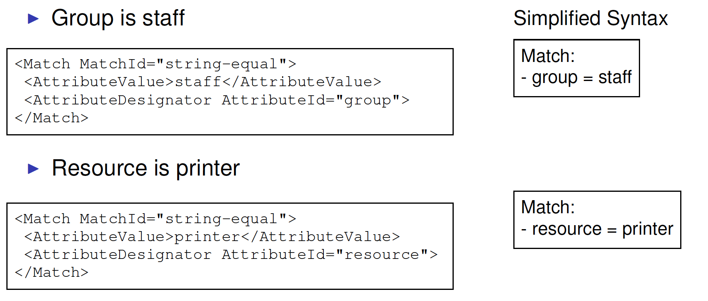

#### Example: < Target >

The ⟨Target⟩ element defines which requests are applicable: 

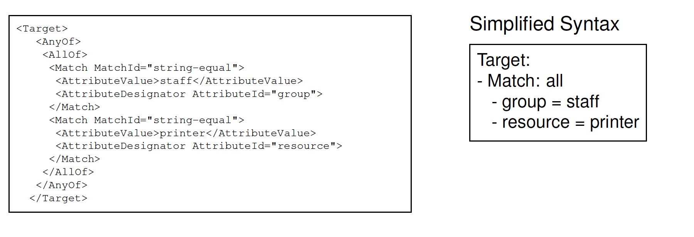

#### Example: Policy

Access is permitted to the printer for members of the staff.
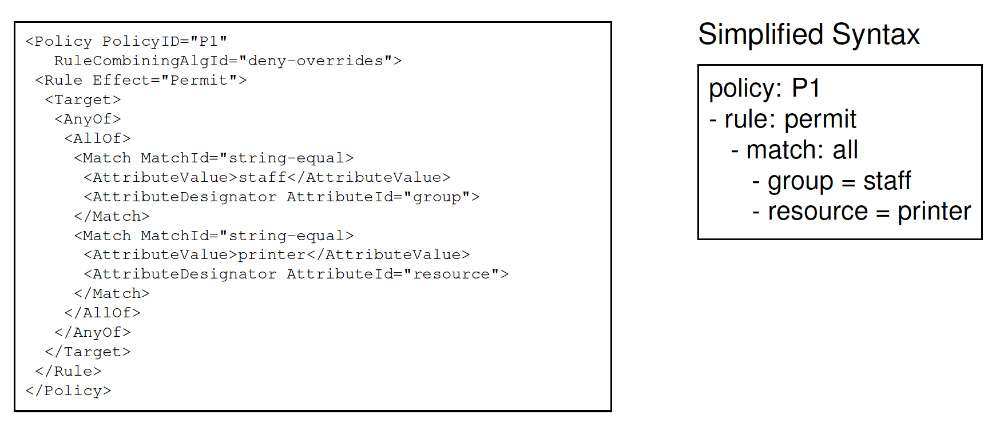

### Policy Hierarchy

## Access Request 

How to specify access request?

### ⟨Request⟩

ReturnPolicyIdList [Required]

* used to request that the PDP return a list of all fully applicable policies and policy sets which were used in the decision as a part of the decision response.

⟨Attributes⟩ [One to Many] 

* Specifies information about attributes of the request context by listing a sequence of ⟨Attribute⟩ elements associated with an attribute category. One or more ⟨Attributes⟩ elements are allowed. Different ⟨Attributes⟩ elements with different categories are used to represent information about the subject, resource, action,environment or other categories of the access request.

#### Example: Request 
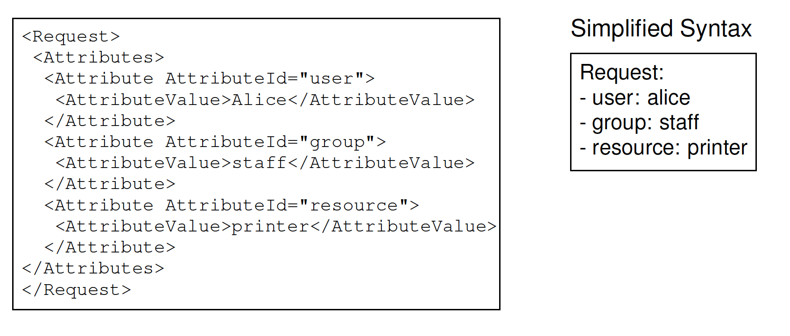

Alice, a staff member, wants to access the printer.

## Policy Evaluation 
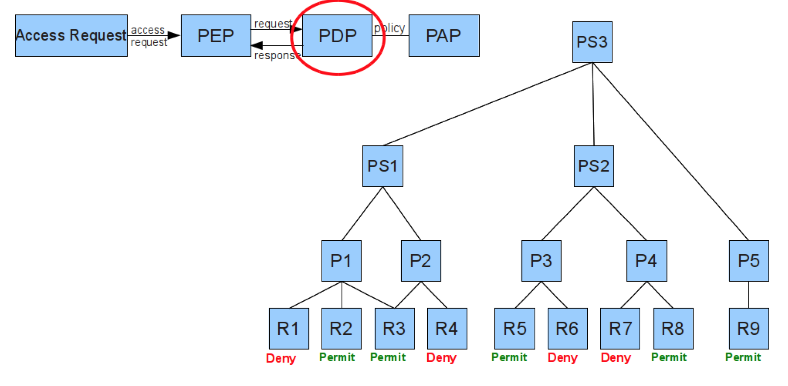

### Policy Applicability

* A Rule/Policy/PolicySet has a target 

  - Attributes of subject, object, action, environment

* Access Requests specify a context 
  * Attributes of subject, object, action, environment

* Rule/Policy/PolicySet is applicable if the attributes in the access request “match” the attributes in the target

**REMARK**: Attributes in the target have attribute *MustBePresent*. In case that no matching attribute is present in the request, then the attribute is considered missing. If the attribute is missing, then *MustBePresent* governs the applicability of the Rule/Policy/PolicySet

* If *MustBePresent* is “False” (default value), then a missing attribute results in “NotApplicable”
* If *MustBePresent* is “True”, then a missing attribute results in“Indeterminate”

### Target evaluation

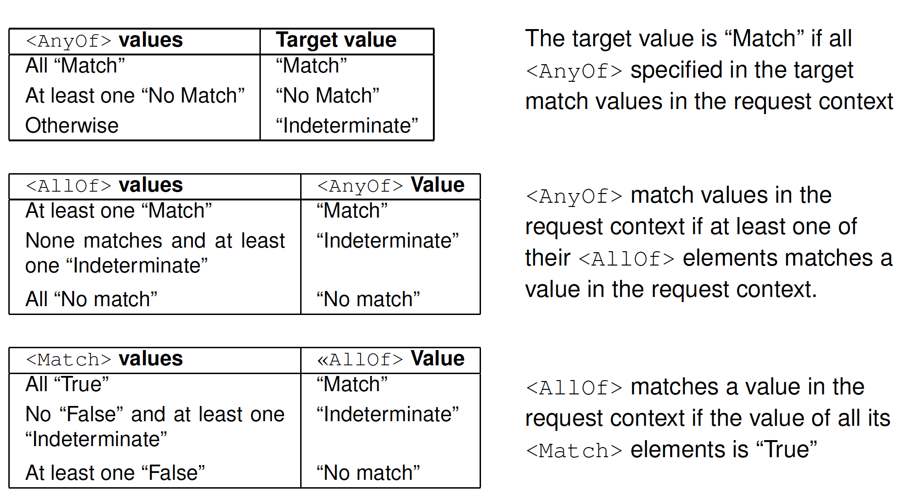

#### Example: Target evaluation

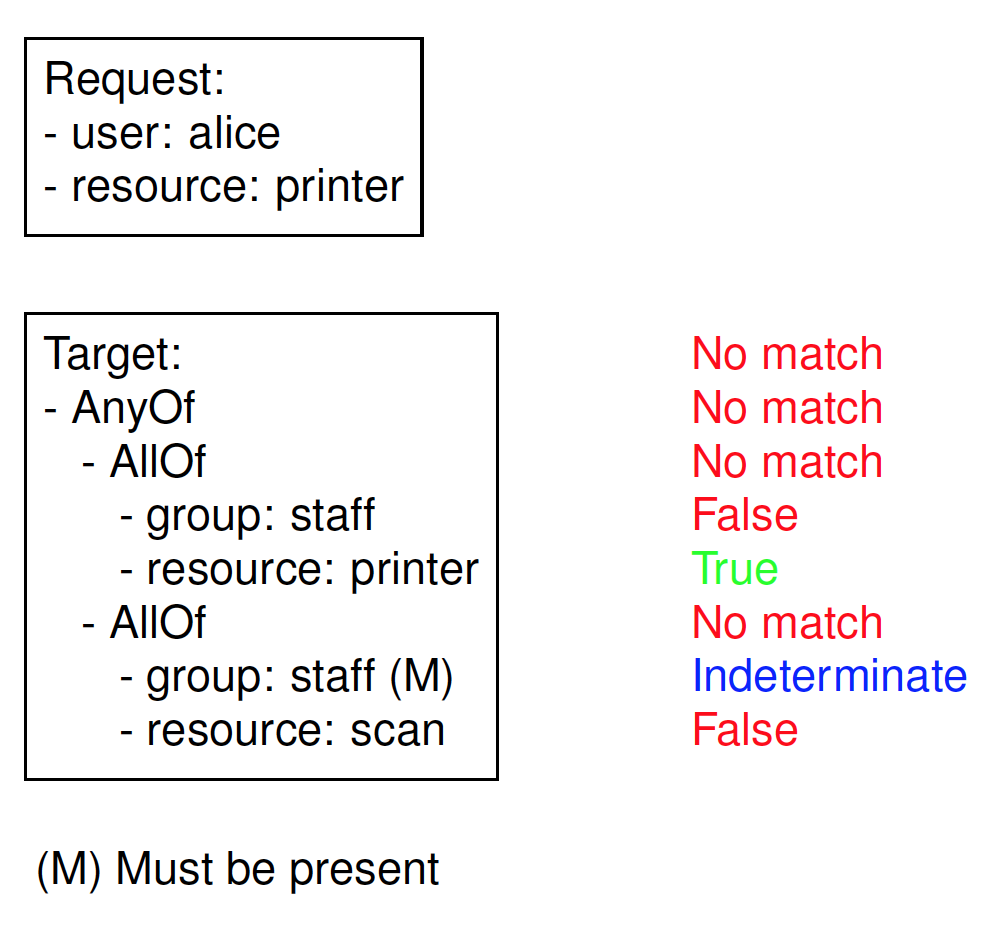

### Access Decision Set

* Permit (P)
  *  requested access is permitted
* Deny (D)
  * requested access is denied
* Indeterminate (I) 
  * PDP is unable to evaluate the request 
  * missing attributes, network errors while retrieving policies, division by zero during policy evaluation, syntax errors in the decision request or in the policy, etc.
* NotApplicable (NA) 
  * PDP does not have any policy that applies to the request

### Extended Indeterminate Set

Record potential effect value when errors occur 

* Indeterminate{P} (I{P}) 
* Indeterminate{D} (I{D}) 
* Indeterminate{PD} (I{PD})

Used by some combining algorithms

### Decision Set Projection

### Rule evaluation

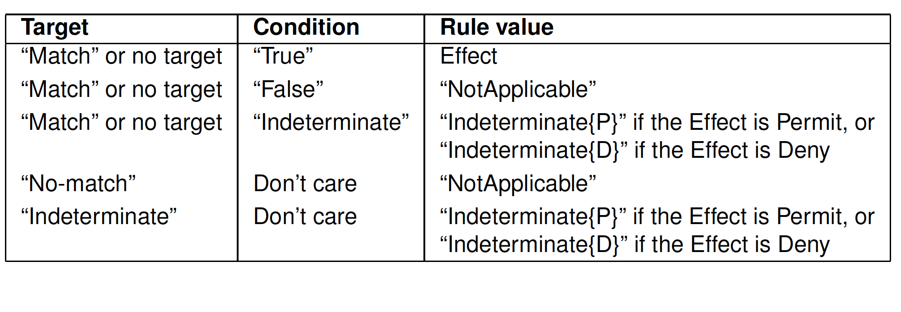

#### Example: Target evaluation

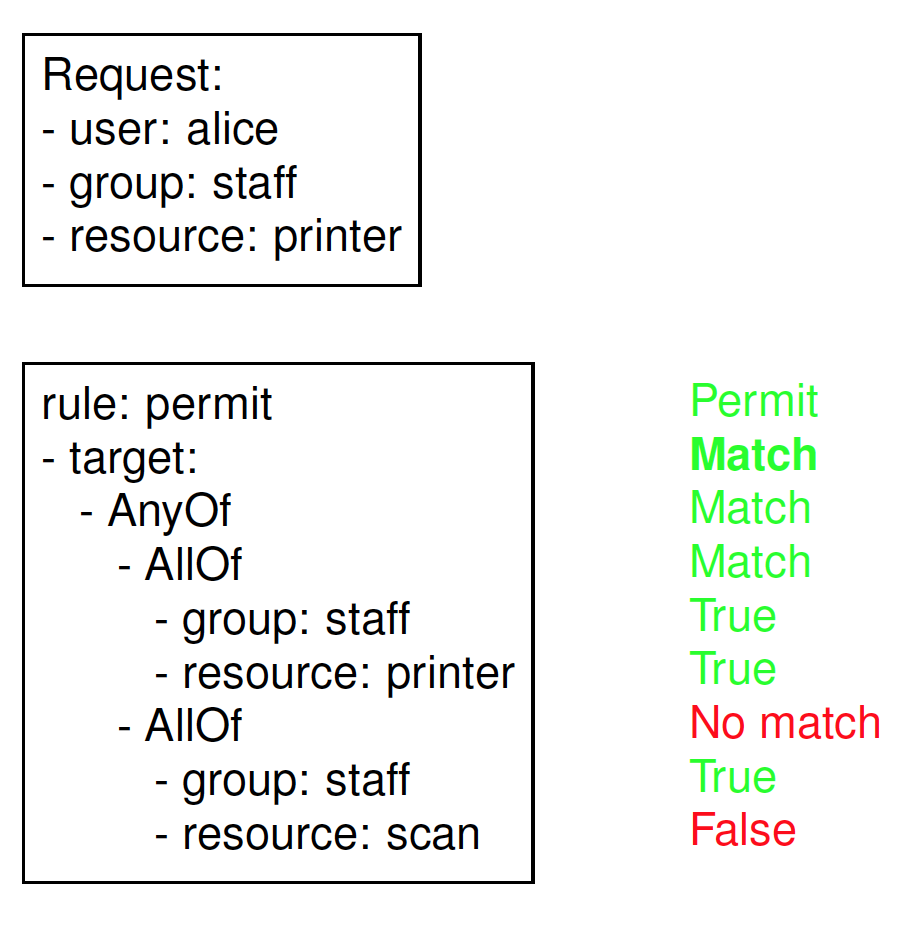

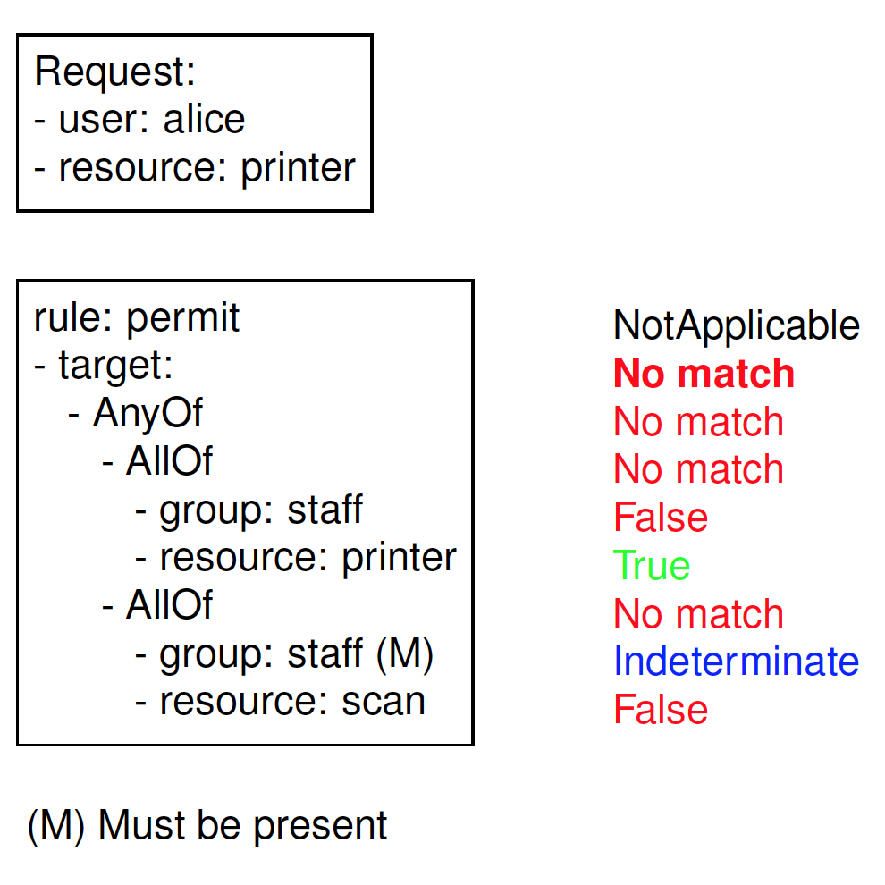

Different rules and policies can be applicable!!

### Combining Algorithms

* Deny-overrides
* Ordered-deny-overrides 
* Permit-overrides 
* Ordered-permit-overrides 
* Deny-unless-permit
* Permit-unless-deny
* First-applicable
* Only-one-applicable (only PolicyCombiningAlgorithm)

### Deny Overrides (Defined over D6)

### Permit Overrides (Defined over D6)

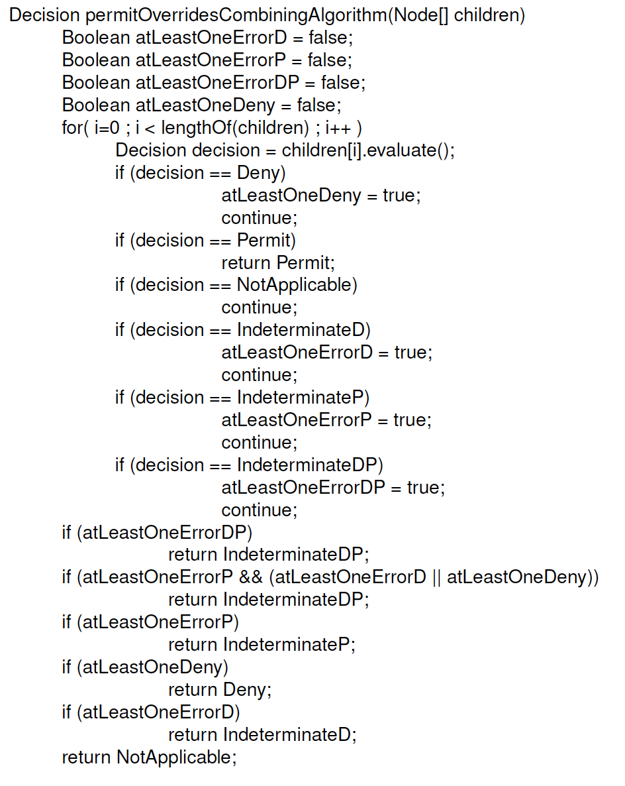

### First Applicable (Defined over D4)

### Only One Applicable (Defined over D4) only for Policies

### Other combining algorithms

* Ordered-deny-overrides
  * Identical to Deny-overrides combining algorithms
  * with one exception... 
  * Order in which rules are evaluated SHALL match the order as listed in the policy
* Ordered-permit overrides 
* Deny-unless-permit 
* Permit-unless-deny 
* To be studied: **XACML specification (pages 135-147)**

### Combining Algorithms: Example

 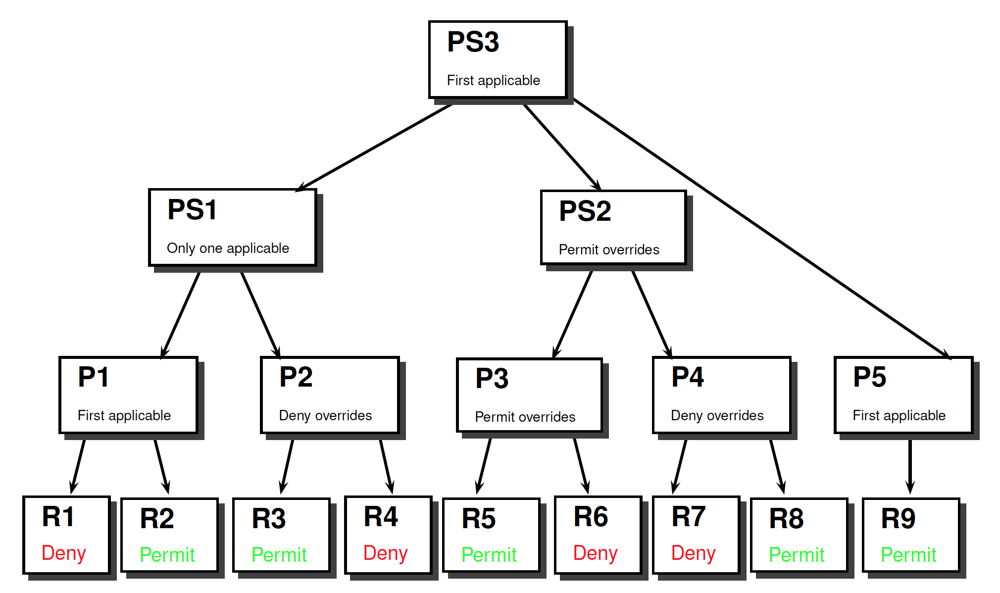

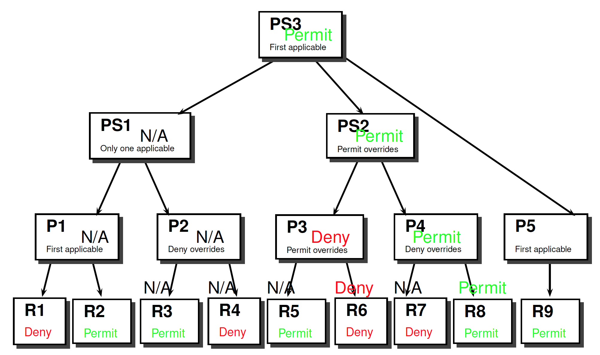

看课件

### Obligations

In XACML **post obligations** 

Rules, policies and policy sets may contain one or more **ObligationExpressions**

**FulfillOn** determines when an obligation should be considered 

Obligations passed up to the next level of evaluation

Obligations are not passed up

* if the rule, policy or policy set is not evaluated
* if result is “Indeterminate” or “NotApplicable” 
* if decision does not match FulfillOn attribute

only obligations associated with evaluation paths 

When nondeterminism is unacceptable, use deterministic combining algorithms 

* ordered-deny-overrides 
* ordered-permit-overrides

 

### Obligations: Example

 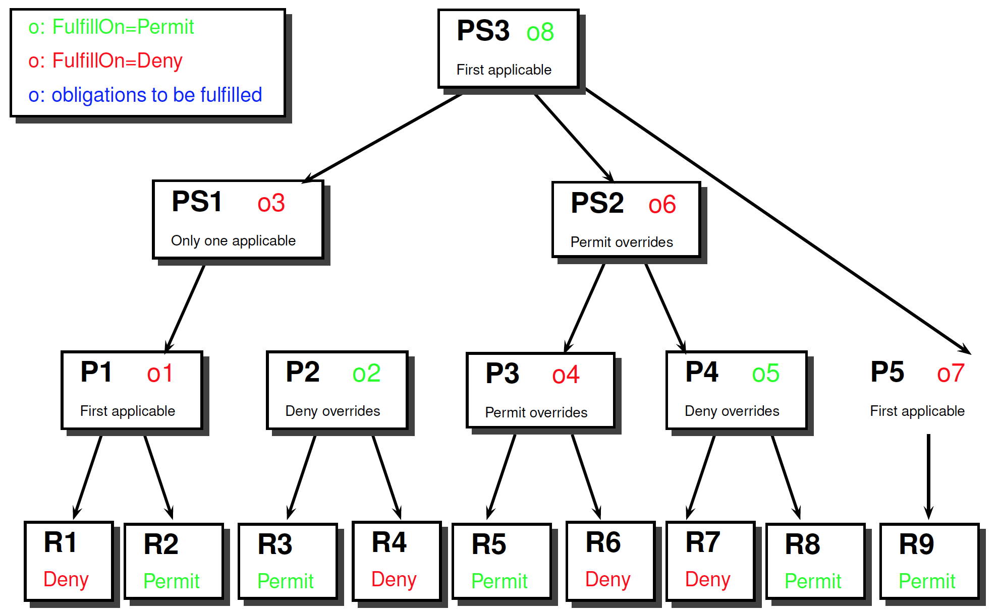

 

 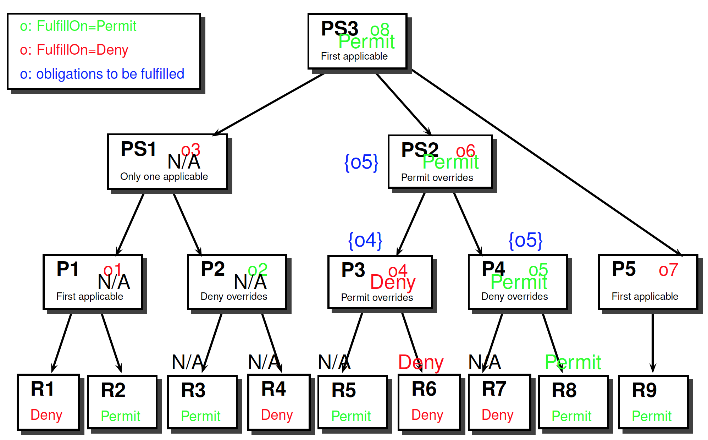

 

## Response

* Specification of policies 
* Applicability of policies 
* Access decision 
* Combining algorithms 
* Obligations

### ⟨Result⟩

Represent authorization decision 

⟨Decision⟩ [Required] 

* The authorization decision: ‘**Permit, Deny, Indeterminate or NotApplicable**

⟨Status⟩ [Optional] 

* Indicate whether errors occurred during evaluation

⟨Obligations⟩ [Optional] 

* list of obligations that MUST be fulfilled by the PEP 

⟨AssociatedAdvice⟩ [Optional] 

* list of advice that provide supplemental information to the PEP

⟨PolicyIdentifierList⟩ [Optional] 

* If the ReturnPolicyIdList attribute in the ⟨Request⟩ is true, PDP MUST return a list of all policies which were found to be fully applicable. That is, all policies where both the ⟨Target⟩ matched and the ⟨Condition⟩ evaluated to true, whether or not the ⟨Effect⟩ was the same or different from the ⟨Decision⟩.

### ⟨Response⟩

Encapsulate authorization decision made by PDP

Include a sequence of one or more resultsI 

⟨Result⟩ [One to Many] 

* authorization decision 
* one ⟨Result⟩ element per requested resource

## Exercise

Exercise (Text is in the repository)

### Hints

* Build policy hierarchy 
* Annotate it with relevant information
  * Target 
  * Combination algorithm 
  * Obligations (and FulfillOn)
* Match target with request context 
* Response = decision + set of obligations

### Solution
Access request
* Subject
  * Alice
  * Nurse
* Resource
  * med:record
* Action
  * read

## Reference

eXtensible Access Control Markup Language (XACML) Version3.0, OASIS Standard, January 2013. http://docs.oasisopen.org/xacml/3.0/xacml-3.0-core-spec-os-en.pdf

xacml 简介. http://www.cinlk.com/2015/07/27/xacml/

