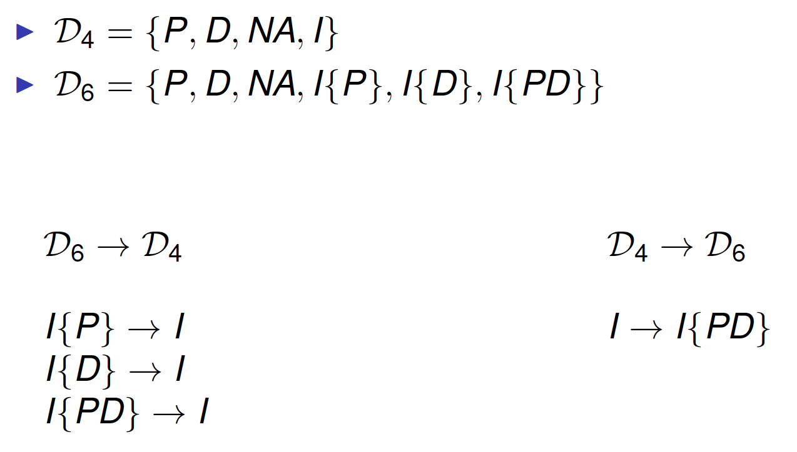
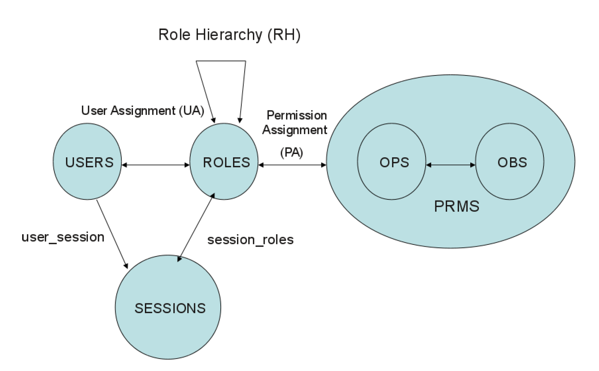
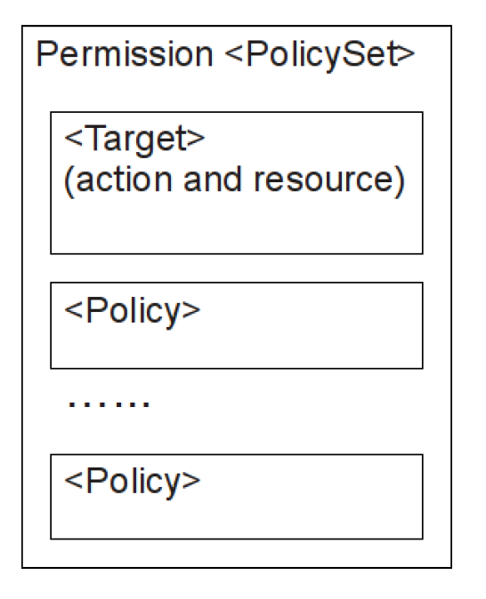
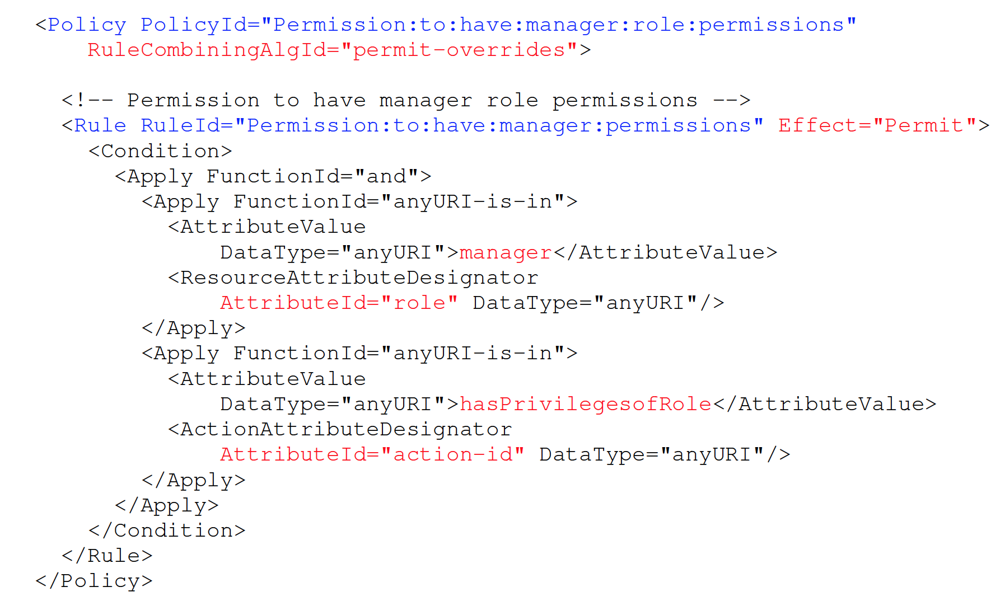
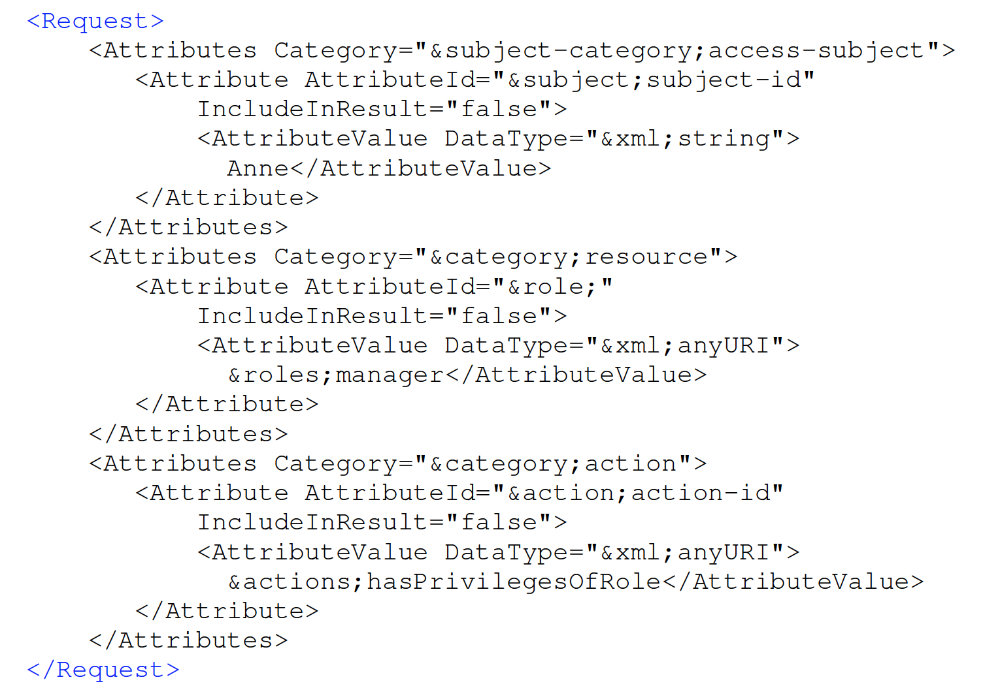

# eXtensible Access Control Markup Language (XACML) Part 2

##Review

###XACML

* OASIS standard
* Federate administration of policies about the same resource 
* XACML Core Specification 
  * attribute-based access control policy language 
    * implemented in XML
    * default attributes and functions
  * language to express access requests and responses 
  * policy evaluation process 
  * high-level architecture (PEP, PDP, PIP, PAP, etc.)

###XACML Architecture

###XACML Policy Model

 

###Access Request & Policy Applicability

 

* Access Requests specify a context 
  * Attributes of subject, object, action, environment

* A Rule/Policy/PolicySet has a target 
  * Attributes of subject, object, action, environment
  
* Rule/Policy/PolicySet is applicable if the attributes in the accessrequest “match” the attributes in the target

###Access Decision

* Permit: requested access is permitted 
* Deny: requested access is denied 
* Indeterminate: PDP is unable to evaluate the request 
* NotApplicable: PDP does not have any policy that applies to the request

**REMARK**: Attributes in the target have attribute *MustBePresent*. In case that no matching attribute is present in the request, then the attribute is considered missing. If the attribute is missing, then *MustBePresent* governs the applicability of the Rule/Policy/PolicySet

* If *MustBePresent* is “False” (default value), then a missing attribute results in “NotApplicable”
* If *MustBePresent* is “True”, then a missing attribute results in“Indeterminate”

###Extended Indeterminate Set

Record potential effect value when errors occur 

* Indeterminate{P} (I{P}) 
* Indeterminate{D} (I{D}) 
* Indeterminate{PD} (I{PD})

Used by some combining algorithms

###Decision Set Projection

 

###Combining Algorithms

* Deny-overrides 

* Ordered-deny-overrides 

* Permit-overrides 

* Ordered-permit-overrides 

* Permit-unless-deny 

* Deny-unless-permit 

* First-applicable 

* Only-one-applicable

   

###Obligations

* In XACML **post obligations** 
* A policy or policy set may contain one or more obligations
* Obligations passed up to the next level of evaluation 
* No obligations are passed up 
  * if the policy or policy set is not evaluated 
  * if result is “Indeterminate” or “NotApplicable” 
  * if effect does not match FulfillOn attribute

###Response

* Access Decision
* Obligations

##Outline

* RBAC Profile
* Privacy Profile
* Exercise

##RBAC Profile

###RBAC

Facilitate policy specification and management

* RBAC0 
  * Roles based on job functions 
  * Users assigned to roles 
  * Permissions assigned to roles

* RBAC1 = RBAC0 + Role hierarchy 
* RBAC2 = RBAC0 + Constraints 
* RBAC3 = RBAC1 + RBAC2

###RBAC0

 

###RBAC1

 

###RBAC Profile - Scope

RBAC profile answers three types of questions:

1. If a subject X has roles R1,R2, …,Rn enabled, is X allowed to perform a given action on a given resource?
2. Is subject X allowed to have role Ri enabled?
3. If a subject X has roles R1,R2, …,Rn enabled, does that meanX will have permissions associated with a given role R'? 
   1. In other word, is role R' either equal to or junior to any of roles R1,R2, …,Rn?

NOT supported 
* Separation of Duty

###Policies in RBAC Profile

**Role**: < PolicySet > that associates permissions with a role 

**Permission**: < PolicySet > that define permissions 

**Role Assignment**: < Policy > or < PolicySet > that defines which roles can be assigned to a subject

* Actual assignment of roles to users outside scope of XACML PDP

**HasPrivilegesOfRole**: < Policy > in a Permission< PolicySet > that supports requests asking whether a subject has the privileges associated with a given role

###RBAC0 in XACML

**User** expressed using XACML Subjects 

**Roles** 

* Single attribute identifier and an attribute value for each role(recommended) 
  * urn:oasis:names:tc:xacml:2.0:subject:role
* An attribute identifier for each role (empty value)
  * urn:someapp:attributes:employee-role
* Same representation within a policy domain

**Objects** expressed using XACML Resources

**Operations** expressed using XACML Actions 

**Permissions** expressed using Permission < PolicySet > 

**Permissions-Role Assignment** expressed using Role< PolicySet >

###Role < PolicySet >

Determine whether a subject holds a certain role 

* < Target > of Role < PolicySet > limits the applicability of the < PolicySet > to subjects holding a ceratin role 
* Each Role < PolicySet > references a single Permission < PolicySet > 
  * No contain or reference any other < Policy >or < PolicySet >

###Permission < PolicySet >

Define the permissions associated to a certain role 

* One Permission < PolicySet > for each role 
* Permission < PolicySet > contains < Policy > and < Rule > elements that describe the resources and actions that subjects are permitted to access 
* < Target > MUST NOT limit the subjects to which the < PolicySet > is applicable 
  * including contained or referenced PolicySet/Policy/Rule

  

###Example

Role < PolicySet > for employees

Permission < PolicySet > for employees 

###Evaluation

Permission < PolicySet > cannot be used as initial policy by PDP 

Permission < PolicySet > MUST be reachable only through the corresponding Role Permission < PolicySet > 

* To support inheritance, Permission < PolicySet > must be applicable to any subject

###RBAC1 in XACML

**Role inheritance** defined by policy structure 

Permissions associated with one role includes permissions associated with more general roles

###Permission < PolicySet >

Define the permissions associated to a certain role 

* One Permission < PolicySet > for each role 
* Permission < PolicySet > contains < Policy > and< Rule > elements that describe the resources and actions that subjects are permitted to access 
* < Target >, if present, MUST NOT limit the subjects to which the < PolicySet > is applicable  
  * including contained or referenced PolicySet/Policy/Rule
* Permission < PolicySet > MAY also contain references to Permission < PolicySet >s associated with other roles that are generalizations of the given role 
  * Inherit all permissions associated with the role of the referenced Permission < PolicySet >

###Example

 

###Multi-Role Permissions

A user must hold several roles simultaneously to gain access to a certain permission 

* < Target > of Role < PolicySet > requires specifying all roles 
  * a single < AllOf > element containing multiple < Match >elements 
* Associated Permission < PolicySet > specifies permission associated with subjects who have all role enabled 
* Associated Permission < PolicySet > may refer to Permission< PolicySet >s associated with individual roles 
* All necessary roles have to be specified in Request context

Subjects has the permissions associated with 

* each role individually 
* multi roles

###HasPrivilegesOfRole < Policy >

Used to allow queries asking if a subject “**has the privileges of**” a specific role 

Included in a Permission < PolicySet > 

If this type of request is to be supported, then a HasPrivilegesOfRole < Policy > MUST be included in each Permission < PolicySet >

 

###HasPrivilegesOfRole < Policy > for managers

 

###HasPrivilegesOfRole < Request > 

 

##Privacy Profile

###Privacy-aware Access Control

Access control policies include **Subject** ,**Object** ,**Actions**

Privacy-aware access control policies also include

* **Purpose**: the intended use of data 
* **Obligations**: mandatory requirements to be fulfilled
* **Conditions**: restrictions under which a policy is applied

###Privacy Profile

No element for purpose 

Two optional purpose attributes: 

* urn:oasis:names:tc:xacml:2.0:resource:purpose 
  * purpose for which data were collected
* urn:oasis:names:tc:xacml:2.0:action:purpose 
  * purpose for which data are requested

No purpose hierarchy

###Matching purpose

 

###XSPA Profile

Cross-Enterprise Security and Privacy Authorization (XSPA) Profile of XACML v2.0 for Healthcare 

* Healthcare Treatment 
* Emergency Treatment 
* System Administration
* Operations 
* Payment 
* Research 
* Marketing 
* Public Health

##Summary

XACML can be extended to cope with specific issues 

* RBAC profile
* Privacy profile 
* Others 
  * XACML v3.0 Administration and Delegation Profile Version 1.0 
  * XACML v3.0 Hierarchical Resource Profile Version 1.0
  * SAML 2.0 Profile of XACML, Version 2.0
  * XACML v3.0 XML Digital Signature Profile Version 1.0

##Exercise

##References

eXtensible Access Control Markup Language (XACML) Version3.0 http://docs.oasis-open.org/xacml/3.0/xacml-3.0-core-specos-en.pdf 

XACML v3.0 Core and Hierarchical Role Based Access Control(RBAC) Profile Version 1.0 http://docs.oasisopen.org/xacml/3.0/xacml-3.0-rbac-v1-spec-cs-01-en.pdf

XACML v3.0 Privacy Policy Profile Version 1.0 http://docs.oasisopen.org/xacml/3.0/xacml-3.0-privacy-v1-spec-cs-01-en.pdf 

Cross-Enterprise Security and Privacy Authorization (XSPA)Profile of XACML v2.0 for Healthcare (Committee Draft)