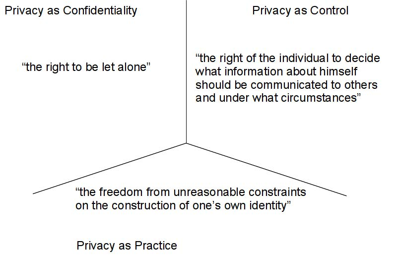
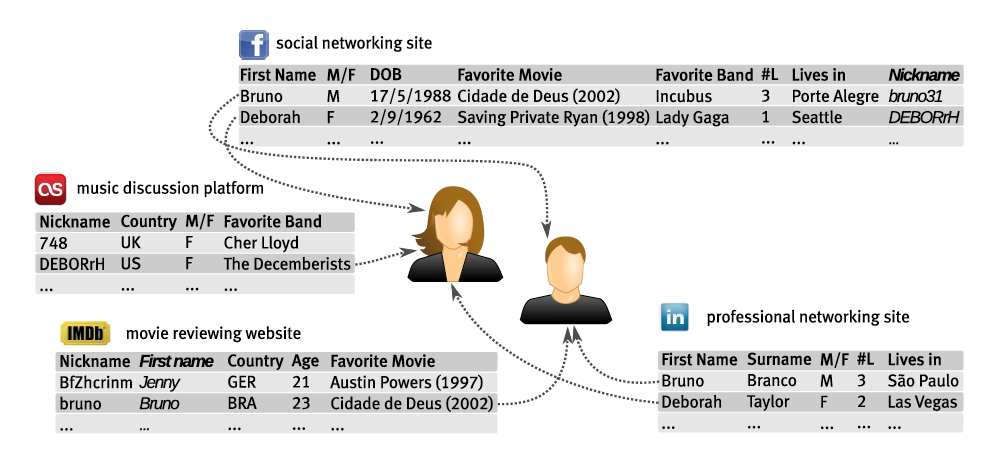
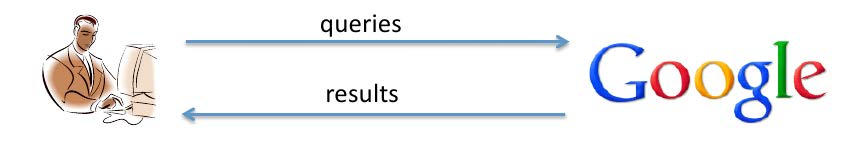
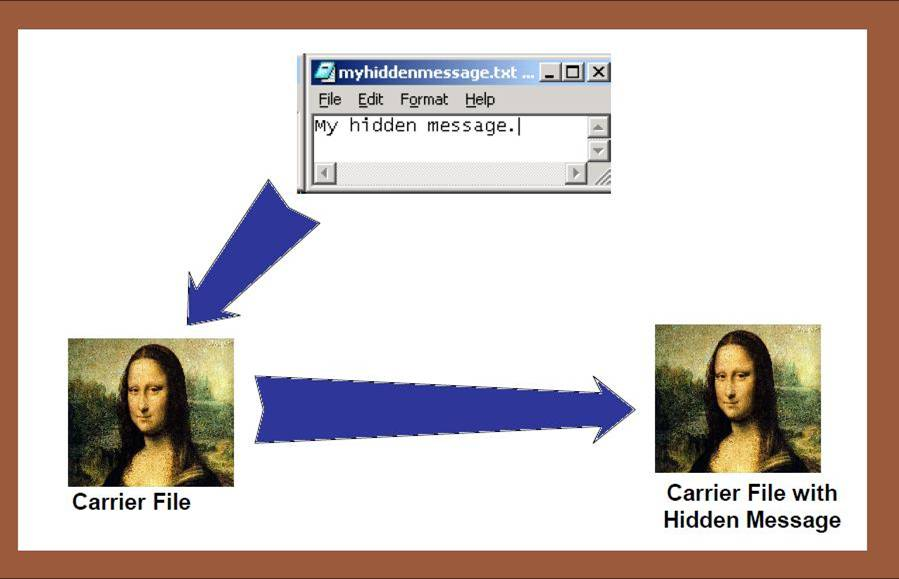

#Introduction

##About
- Data Protection and Privacy
- Access Control
- Policy Languages, Models, and Standards

##Course Objectives
Understand the relevance of data protection
A detailed understanding of the most important access control models
Knowledge of the well-established privacy principles
Ability to specify access control and privacy policies
Ability to evaluate access control and privacy policies

##Topics covered
- Access Control
- Usage Control
- Privacy-aware Access Control
- eXtensible Access Control Markup Language(XACML)
- A taste of research

##Outline
- Defining Privacy
- Privacy Threatss
- Appliaction
  - Location-based services
  - RFID
  - Social Networks
- Privacy Enhancing Technologies

##Defining Privacy
Abstract and subjective concept, hard to define-->Dependent on cultural issues, study discipline, stakeholder, context

Popular definitions:
- (Privacy as Confidentiality)“The right to be let alone” (Brandeis & Warren, 1890)-->Focus on freedom from intrusion
- (Privacy as Control)“The right of the individual to decide what information about himself should be communicated to others and under what circumstances”(Westin, 1967)-->Focus on control/Focus on information self-determination
- (Privacy as Practice)“The freedom from unreasonable constraints on the construction of one’s own identity” (Agre, 1999)-->Focus on autonomy

###Privacy Paradigms

###What Privacy is About
- Privacy concerns personal information
- Privacy is more than confidentiality (机密性)
  - Freedom from intrusion(闯入;打扰;(对某事的)干扰, 干涉)
  - Control of informationn about oneself
  - Autonomy(自治，自治权)

##Privacy Threats
How much privacy do we have left?
###Data Life Cycle

###Taxonomy(分类学,分类系统) of Privacy Threats(Solove)
- Information collection
  - surveillance(监视)
  - interrogation(讯问(审问)的行为实例;讯问(审问)过程，疑问句;问题)
- Information processing
  - aggregation(聚集,集成;集结;聚集体,集成体)
  - identification
  - insecurity
  - secondary usage
  - exclusion
- Information dissemination(散播;宣传)
  - breach(破坏, 违反;破裂, 不和;缺口, 裂口;攻破;破坏, 违反) of confidentiality
  - disclosure
  - exposure
  - increased accessibility
  - blackmail
  - appropriation(拨付,拨发;拨款;占用,挪用,盗用)
  - distortion(曲解;失真)
- Invasion(侵犯；入侵，侵略；侵袭)
  - intrusion
  - decision interference(干涉, 介入;阻碍, 干扰)

###Secondary Usage
Use information for a purpose other than the one for which it was obtained

- Use of customer information for marketing
- Sale(or trade) of consumer information to other businesses
- Government agencies' use of consumer database

###Aggregation
Combining and comparing information from more than one database

- Why aggregation is a problem? Data already in the system
- Individual pieces of data may be not very telling
- But when combined together, they may reveal(显示; 露出;泄露; 透露) more information about a person
  

- Aggregated information about a person is often used to judge her
- Amazon.com uses aggregated data about book-buying history to recommend other books
- Sharing of government agencies’ databases to detect frauds
- Insurance companies can make decisions based on information of diseases, lifestyles, etc.
- Aggregations of credit reports used to evaluate a person’s financial reputation for granting loans

###Video Surveillance
CCTV monitoring at public places(airports, malls,...)

###Other Threats
- Invisible Information Gathering
  - Satellite surveillance
  - Loyalty cards(e.g., supermarket club cards)
  - Web-tracking data; cookies
  - ISPmonitoring
    - Your ISP "knows" every site you visit
    - Google stores your search history
- Profiling 例子17页
  - Use of customer preferences to predict behaviors of people 
  - Profiling customers to determine their propensity(倾向;习性) toward a product/service
  - Government agencies create descriptions of possible terrorists
- Identity Theft
- Discrimination (propensity)

###Why now?
Computers not needed for the invasion of privacy

Digitization of information make it possible to
- collect and store massive amout of personal information
- correlate information from different sources
- access information on the network locally or remotely

  Computers simply make new threats possilbe and old threats more powerful

##Applications
- Location-based services
- RFID
- Social Networks

###How many ways can we be located today?

- cell phone (turned on?)
- laptop
- credit card at the gas station
- bank card in the ATM machine
- driving through a monitored intersection
- security camera at the supermarket
- scan badge to enter a building
- ...

###Location Based Service
- location-based traffic monitoring and emergency services
  - e-Call, traffic congestion control
- location/service finder:
  - where is the nearest restaurants, gas station,..
  - variable pricing applications
  - congestion pricing
  - pay-as-you-drive
- social applications
  - Geotagged Twitter
  - Google Latitude

####Why is this a problem?
- do you want to be seen at certain location (abortion clinic, AIDS clinic, business
  competitor, or political headquarters)
- what can be automatically inferred about a person based on location? 
  - any important location...
    - desk in a building
    - home location
    - future locations
  - and even identification!

###RFID Technology
- Radio Frequency Identification
- A micro-chip transmitting data when exposed to radio waves
- Conceptually similar to bar code-->used to identify and track objects of interest

###RFID Data Collection Process

###RFID Application

###RFID From the news
2006: President of Colombia agreed to require Colombian
citizens to be implanted with RFID chips before they could gain
entry into the US for seasonal work.

2008: UK jails considering RFID implants for prisoners.

2015: Tenants of a hi-tech office block in Sweden implanted with
RFID chips in order to gain access to the office and operate
photocopiers.

###RFID-Privacy Issues

- Traceability
- Disclosure of embarrassing information
- Discrimination
- Target by muggers
- ...

##Social Networks
Many people publish their personal information on social networks

###Social Networks--Privacy Issues 见30,31,32

- Used by professors, parents, and employers
- Used by law enforcement and college administrators for disciplinary action
- Used for surveillance and data mining
- Used by merchants for marketing
- Use by other members for criminal purposes (e.g., stalking, invasion of privacy)

##Privacy Enhancing Technologies
How can we protect privacy?

###Scenario

###Privacy as Control: Assumptions
- Collection and Processing of personal information is useful and necessary
  - Search engines: historical search data helps improve search algorithms
  - Hospital: health records
- Organizations have an interest in protecting user privacy
  - Organization trusted to enforce user privacy preferences
- Privacy problems arise when personal information is misused

###Privacy as Control: Threats
- Database of queries can be breached
  - information made public
  - information abused by malicious insider and sold for profit
- Query data used for illegitimate purposes
- Query data shared with other parites without user consent(e.g.,advertisers)
- Time queries are stored("right to be forgotten")

###Privacy as Control: Goals
- Focus on:
  - control over personal data
  - compliance(服从,听从,顺从) with data protection regulations
- Providing individuals with means to control use of their information
  - Information consent, privacy settings
- Providing organizations with means to
  - define and enforce security and privacy policy
  - prevent/detect misuse of personal information

###Privacy Settings
- Allow users to specify their privacy preferences
- Make it easier for users to configure their privacy setting
  - privacy preference languages, e.g., APPEL, XPref
  - default suites of privacy settings
  - privacy wizard that automate configuration of settings

    NOTE: Enforcement of privacy settings is done by the organizationn

###Purpose-based Access Control
- Regulate access to data
- Privacy-aware Access Control languages
  - Specify which action a user can perform on a given objects
  - Specify the allowed usage of data
- Policy enforcement
  - Ensure the purpose of data access is complaint with intended purpose

    NOTE: No control after disclosure of data

####Purpose Control

- Verify whether data have been used for the intended purpose
- Auditing(查账, 审计, 审核; 审计学) Mechanism
  - log data access and processing operations
  - analyze logs to detect policy violations

###Privacy as Control: Main characteristics
- Privacy is defined as the ability to specify acceptable data usage through
  - policies defined by users(settings)
  - policies defined by the organization
- Organizations are trusted to enforce policies

###Privacy as Confidentiality: Assumptions
- Lack of transparency and data protection enforcement
  - once data are under the control of an organization it is very difficult to verify how they are actually used
  - abuse of personal information may not be evident to individuals
- Organizations that collect and process user data are not necessarily competent and honest, security is expensive
  - Incentive to collect and use personal data for financial gain(without regard for user privacy)
  - Large number of reported privacy breaches(Due to the lack of appropriate security practices)
- Placing high trust in organizations makes individual vulnerable(易受伤的, 脆弱的, 敏感的)

###Privacy as Confidentiality: Threats
- Queries themselves are sensitive
- Inferred profiles(aggregated data)
- Linkability of user information across different contexts
- Identifiability: queries are hard to anonymize
- Massive collection of user information is considered in itself a privacy threat
  - allow a variety of privacy violations: discrimination, manipulation, opportunistic abuse
  - information asymmetries(不对称) reinforce power asymmetries: surveillance society

###Privacy as Confidentiality: Goals
- Focus on minimal information disclosure
- Create an individual autonomous sphere free from intrusion
- Disclosure of information is BY DEFAULT prevented, or informaiton is minimally disclosed in a way that cannot be linked back to the individual
  - individuals may still disclose information voluntarily

###Anonymous credentials
- Based on zero-knowledge
- Prover can prove:
  - he holds a credential with certain attributes, or
  - any experession on them(simple arithmetic, boolean)e.g., age>18, gender=female
- Verifier gains no more information
- Applicaiton: E-cash

###Steganography and Covert Communications
- Encryption: hide data content
- Anoymity/unlinkability: hide identities/relations
- Unobservability: hide existence
- Communications:
  - Hide the fact that there is any communications
  - Embed a communication within another
  - Covert channels: hide secrets within public informationn
- Storage:
  - Hide the existence of files
  - Under coercion(强迫；强制；高压政治；威压) can deny there are any files to decrypt
    

###Privacy as Confidentiality: Main Characteristics
- Privacy is defined as properities hard-coded in the technology itself
  - Goal of technology is to ensure privacy properties hold
- Preventing data disclosure
- Minimize the need to trust others for handing sensitive data

###Privacy as Practice: Assumptions
Transparency provide users with an understanding of the system
- Transparency produces awareness
- Awareness evokes actions

###Privacy as Practice: Threats
Users has no means to know:
- which data are collected
- for which purpose his data are used
- how data are aggregated into profiles
- which decisions are made based on these profiles

###Privacy as Practice: Goals

- Focus on user awareness
- Data collection is made transparent
  - how, why, which data are collected
  - users can intervene in the collection and use of data
- Data processing is made transparent
  - discover undesirable privacy practices of organizations

###P3P:Platform for Privacy Perferences
- Allow websites to communicate their privacy policies
- Provides a standard XML format to encode privacy policies
- Help users understand privacy policies

  NOTE: No enforcement!

###Transparency Tools

- Give users a better understanding of information flow, state and history
  - Become aware of how they (and others) participate in the socio-technical system
  - Verify whether their personal privacy level fits within the current working of the system
  - How they can take actions to change their own behavior as well as teh socio-technical environment
- Tools
  - Google dashboard: see which info is associated to your account
  - Fackbook: view how others see your profile

###Privacy as Practice: Main characteristics
- Main objective is to support users in decision making
- Potential to uncover malicious behavior by organizations

##Summary
|                                          | Control                                  | Confidentiality                          | Practice                                 |
| ---------------------------------------- | ---------------------------------------- | ---------------------------------------- | ---------------------------------------- |
| Privacy definition:who fills the term privacy with meaning? | Organization-centric                     | Techno-centric                           | User-centric                             |
| Data Lifecycle                           | Information usage                        | Information disclosure/collection        | Transparency in data disclosure, collection and use |
| Trust/adversary model                    | Organization trusted, individual untrusted | Powerful threat model, rigorous security analysis | No threat model                          |
