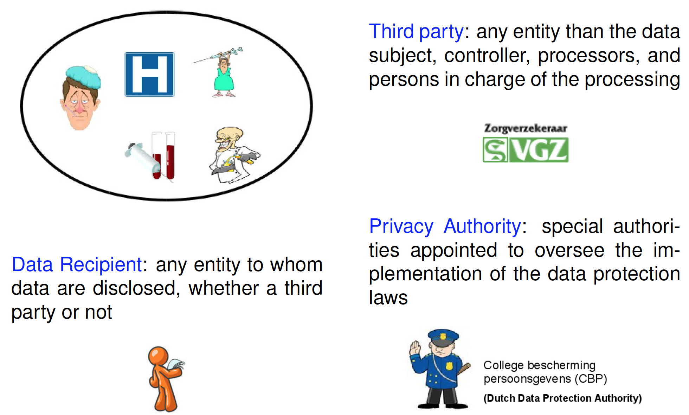

# Introduction to Privacy

##Outline

* What is privacy 
* European Data Protection Legislation 
* Basic Concepts 
* Privacy Principles & Data Subject’s Rights

##What is privacy

> The right to be let alone.	--L. Brandeis, S. Warren 1890

> Claim of individuals, groups and institutions to determine forthemselves, when, how and to what extent information about them iscommunicated to others	--Westin 1967

> Freedom from unreasonable constraints on the construction of one’sown identity	--Agre 1999

###Privacy is About...

Privacy concerns personal information 

Privacy is more than confidentiality 

* Freedom from intrusion 
* Control of information about oneself 
* Freedom to construct own identity

Privacy is user-centric

###Why do we need to know about privacy?

* Subject of this course
* Privacy is a basic human right 
* There are laws 
* Breaches can be costly – in $ and reputation 
* We all expect our privacy to be protected

###Taxonomy(分类学,分类系统) of Privacy Threats(Solove)
- Information collection
  - surveillance(监视)
  - interrogation(讯问(审问)的行为实例;讯问(审问)过程，疑问句;问题)
- Information processing
  - aggregation(聚集,集成;集结;聚集体,集成体)
  - identification
  - insecurity
  - secondary usage
  - exclusion
- Information dissemination(散播;宣传)
  - breach(破坏, 违反;破裂, 不和;缺口, 裂口;攻破;破坏, 违反) of confidentiality
  - disclosure
  - exposure
  - increased accessibility
  - blackmail
  - appropriation(拨付,拨发;拨款;占用,挪用,盗用)
  - distortion(曲解;失真)
- Invasion(侵犯；入侵，侵略；侵袭)
  - intrusion
  - decision interference(干涉, 介入;阻碍, 干扰)

###Other Privacy Threats

* Invisible Information Gathering 
* Profiling
* Monitoring and Tracking
* Identity Theft

##European Data Protection Legislation

###Context for privacy laws

> Technological advances are rapidly changing the wayinformation is collected and processed

**Huge increase in the amount of** information collected and stored 

**Electronic information is more vulnerable and more fluid** Large amounts of information can be easily 

* copied, searched, aggregated and interlinked 
* stored on small, portable devices 
* disseminated widely

Collection and use of information is **less transparent**

###Goal of privacy laws

Provide citizens with more **control** over how organizations handle their personal information

Encourage **openness** and **transparency**

Right to privacy has to be **balanced** against the necessary flow of information for provision of services

###Privacy and Data Protection in Europe

In the ’50, the Council of Europe recognized privacy as a fundamental right 

* Article 8 of the European Convention of Human Rights and Fundamental Freedoms (Council of Europe, Rome, 1950) **Everyone has the right to respect for his private and family life, hishome and his correspondence**

Between ’70-’93, national regulations in many EU countries 

* The Netherlands (1990)

Need to harmonize data protection laws across Europe 

* Protection of citizens’ privacy 
* Maintenance of free flows of personal data across Member States

###European Data Protection Legislation

**Directive 95/46/EC** of the European Parliament and the Council of 24 October 1995 on the Protection of individuals with regard to the processing of personal data and on the free movement of such data. 

**Directive 97/66/EC** of the European Parliament and of the Council of 15 December 1997 concerning the processing of personal data and the protection of privacy in the telecommunications sector.

**Directive 2002/58/EC** of the European Parliament and the Council of 12 July 2002 concerning the processing of personal data and the protection of privacy in the electroniccommunications sector (replace the directive of 1997). 

**General Data Protection Regulation** aiming to strengthen and unify data protection for individuals within the European Union. Replace Directive 95/46/EC. Formal adoption in early 2016 (??).

###Directive 95/46/EC

* Set guidelines for processing personal information
* Implemented by Member states in national law 
* Follows OECD fair information practices
  * Organization for Economic Co-operation and Development (OECD) 
  * Collection limitation, openness, purpose specification, uselimitation, access, security, participation, accountability
* Facilitates data-flow between member states
* Restricts export of personal data to “unsafe” non-EU countries 
  * Safe Harbor agreement with US Department of Commerce

##Coming...

General Data Protection Regulation (GDPR) 

* Replace Directive 95/46/EC
* Timeline
  * Expected adoption in early 2016 (??)
  * Enforcement to start in December 2017
* Main Changes 
  * Rules apply to all EU member states 
  * Responsibility and accountability 
  * Data breach notification

##Basic Concepts

###Basic Concepts for Privacy

* Data
* Actors
* Purpose
* Consent
* Obligations
* Retention period

###Data

**personal data:** any data that can beused to identify a person

**anonymous data:** any data that cannot be associated to any identified or identifiable data subject

####Personal Data

**identification data:** personal data that permit the direct identification of the data subject

**sensitive data:** any data that disclose information about racial or ethnic origin, religious, philosophical or other beliefs, political opinions, membership of parties, trade unions, associations or organizations of a religious, philosophical, political or trade-unionis tcharacter, as well as personal data disclosing health and sex life. An important subcategory of sensitive data are medical data

####Personal Data-Example

####Data Processing

**Data Processing** encompasses activities such as the collection, recording, organization, storage, use, transmission, and destruction of personal data.

Who is involved in data processing?

###Main Actors

 

####Other Actors

 

###Purpose

The **purpose** is the rationale of the processing, on the basis of which all the actions and treatments have to be performed

Purpose specifies the reason for which data can be collected and processed

Why do you want to process the data?

 

####Open questions

Purpose Management

Purpose Determination 

Purpose Control (Verification)

###Consent

The **consent** is a unilateral action producing effects upon receipt that manifests the data subject’s volition to allow the data controller to process his data.

I authorize you to process my data

* Data processing is legitimate when the data subject has unambiguously given his **informed** and **explicit** consent 
  * Usually a signature or pressing a button
* True consent requires true choice
  * More than “take it or leave it”

####Opt-in vs. Opt-out

**Opt-out**: Actively refusing to authorize to collect, use, or disclose personal information

**Opt-in**: Actively authorizing to collect, use, or disclose personal information

**Double Opt-in**: Confirmation is sent after subscription; Subscriber must respond to the confirmation

###Retention period

The r**etention period** defines how long data shall be kept.

Personal data shall be deleted when retention period expires

###Obligations

An obligation is a mandatory requirement to be fulfilled

Impose constraints on how the data may be used 

Integrated into access control (UCON model) 

* Decision cannot depend only on identity and rights of subjects 
* Necessary to consider the consequences of access

* pre-obligations
* ongoing-obligations
* post-obligations(e.g., delete data once retention period expires)

##Privacy Principles & Data Subject’s Rights

###Privacy Principles

* Fair and lawful processing
* Purpose specification
* Consent
* Minimality
* Minimal disclosure
* Information quality
* Data subject’s control
* Sensitivity
* Information security

**Fair and Lawful Processing**: the collection and processing of personal data shall neither intrude upon the data subjects’ privacy nor interfere with their autonomy and integrity

**Purpose Specification**: personal data shall be collected for specified, lawful and legitimate purposes and not processed in ways that are incompatible with the purposes for which data have been collected

**Consent:** personal data shall be collected and processed only if the data subject has given his explicit consent to their processing

**REMARK:** if consent is not given, personal data can be processed only if processing is necessary 

* to perform a contract to which the data subject is a party
* to comply with a legal obligation imposed upon the controller 
* to protect the data subject’s vital interests
* to perform a task carried out in the public interest or in the exercise of social authority vested in the controller or in a third party to whom the data are disclosed
* to pursue legitimate interests of the controller or the third party to whom the data are disclosed

**Minimality:** the collection and processing of personal data shall be limited to the minimum necessary for achieving the specific purpose. This includes that personal data shall be retained only for the time necessary to achieve the specific purpose

**Minimal Disclosure:** the disclosure of personal data to third parties shall be restricted and only occur upon certain conditions

**Information Quality:** personal data shall be accurate, relevant, and complete with respect to the purposes for which they are collected and processed

**Data Subject Control:** the data subject shall be able to check and influence the processing of his personal data

**Sensitivity:** the processing of personal data, which are particularly sensitive for the data subject, shall be subject to more stringent protection measures than other personal data

**Information Security:** personal data shall be processed in a way that guarantees a level of security appropriate to the risks presented by the processing and the nature of the data

###Data Subject’s Rights

* right to **know** why personal information is collected, used ordisclosed
* right to **know who is responsible** for protecting information
* right to **inspect** collected information 
  * make sure it is accurate, complete and updated 
* right to **delete** information 
  * when requested
  * when no longer required for the intended original purpose 
* right to revoke consent at any time

##Summary

* Privacy is a fundamental human right
* Privacy protected by law
* European Data Protection Legislation
* Basic concepts for reasoning about privacy
* Privacy principles & data subject’s rights

##References

Rakesh Agrawal, Jerry Kiernan, Ramakrishnan Srikant, YirongXu: Hippocratic Databases. VLDB 2002: 143-154 (Obligatory) 

P. Guarda and N. Zannone. Towards the Development ofPrivacy-Aware Systems. Information and Software Technology.51(2):337-350. 2009. (Suggested)