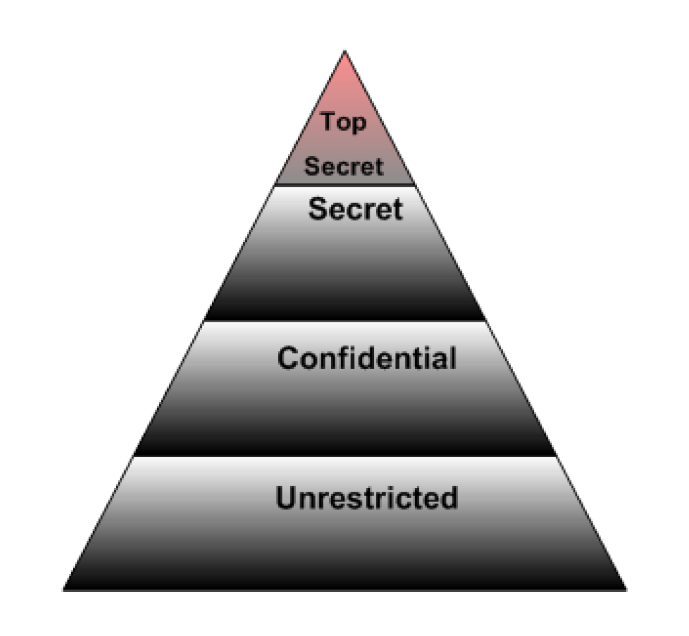
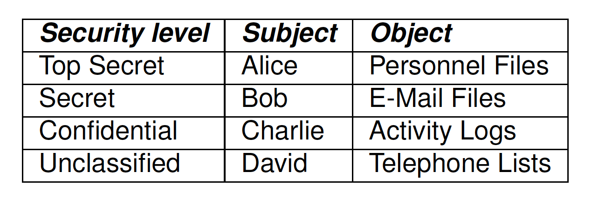
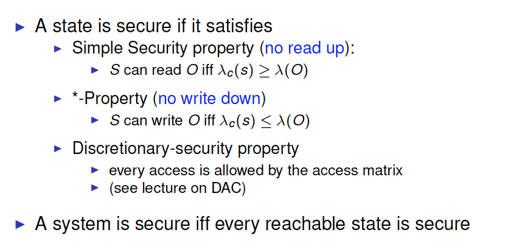
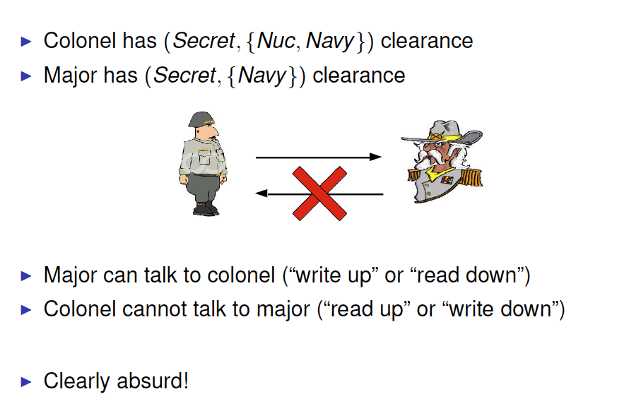
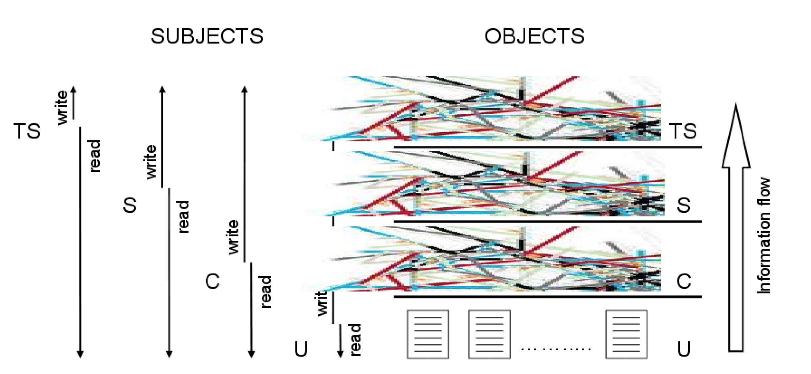
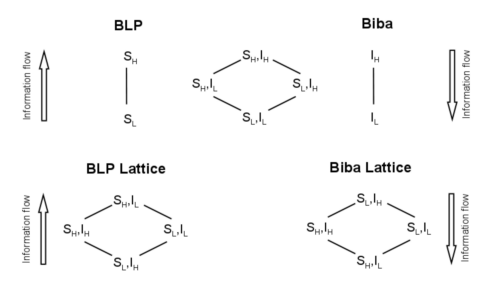
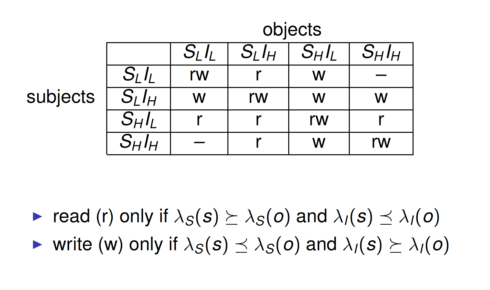
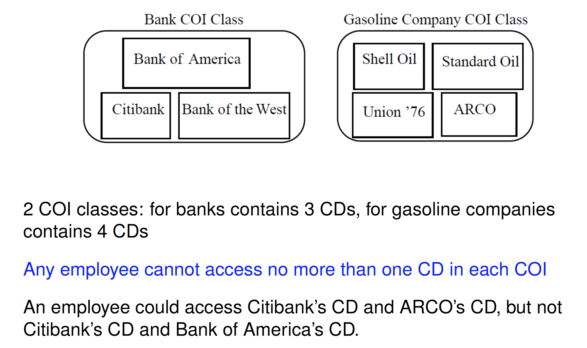
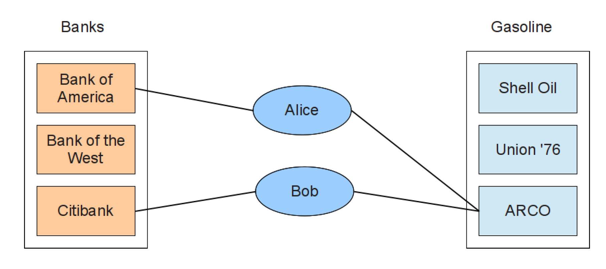

# Mandatory Access Control

- Users do not have full control over their resources
- Access rights entirely determined by the system
- Used in highly classified and confidential environments. e.g., military

##Outline
- Multi-Level Security(MLS)
  - Bell-Lapadula(BLP) Model
  - Biba Model
- Multilateral Security
  - Chinese Wall
- Covert Channels

##Multi-Level Security(MLS)

Access based on security classifications or security levels -

- Users/principals/subjects have security clearances 
- Objects have security classifications

Example of security levels: 

* Top Secret 
* Secret 
* Confidential 
* Unclassified

Dominance: Top Secret > Secret > Confidential > Unclassified 

Security goal: ensure that information does not flow to those not cleared for that level

####Security Classification

Security class usually formed by two components: 

* Security level: elements of a hierarchical set. e.g., TopSecret (TS), Secret (S), Confidential (C), Unclassified (U). TS > S > C > U

* Categories: elements of non hierarchical set. e.g., administrative, financial. Partition different area of competence within the system.

The combination of the two introduces a partial order on security classes, called dominance

​	(L1,C1) >= (L2;C2) => L1 >= L2 ∧ C1 ⊇ C2

####Security Lattice

 自反性；传递性；反对称性

#####Security Lattice: Example

 

####Semantics

**Security level** 

* assigned to **subject** reflects trustworthiness of users (clearance)
* assigned to **objects** reflects the object sensitivity (classification)

**Category** defines the area of competence of users and objects

Evaluation 

* Assign a security class to each subject and object 
* Match between clearance of subject and classification of object to determine when access should be granted

###Bell-Lapadula(BLP) Model

Proposed by David Bell and Len LaPadula in 1973 

The most widely recognized MLS model 

Air Force was concerned with security in time-sharing systems 

* Many OS bugs 
* Accidental misuse

Security goal (confidentiality): Prevent information flow to lower or incomparable security classes

####Hierarchy of Security Levels

 

####BLP Information Flow

Prevent information flow to lower or incomparable security classes

 

Information flow is bottom up

####Example

 

Which files can Alice read? 

* Alice can read all files

Which files can Charlie write? 

* Charlie can write Personnel Files, E-Mail Files and Activity Logs

Which files can David read? And which files can he write?

* David can only read Telephone Lists; he can write all files

####Approach of BLP

Use state-transition systems to describe computer systems

Define a system as secure iff every reachable state satisfies 3 properties: simple-security property, *-property, discretionary-security property 

Basic Security Theorem (BST): check that all state transitions starting in a ‘secure’ state yield a‘secure’ state

####The BLP Security Model

 

####The BLP Security Policy

 

####From BLP to Access Matrix: Exercise

 

####Problem

 

 

####Max/Current Level

 

####Example

Colonel has (Secret,{Nuc, Navy}) clearance 

Major has (Secret, {Navy}) clearance

Treat Major as an object (Colonel is writing to him/her)

Colonel has ℷm = (Secret,{Nuc, Navy})

Colonel sets ℷc = (Secret, {Navy})

Now ℷ(Major)>=  ℷc(Colonel) 

* Colonel can write to Major without violating “no write down” 
* Colonel is trusted to not disclose Nuc information 
* Security class fixed within a session

####Observations

BLP applies to subjects not to users 

Users are trusted not to disclose secret information outside of the system 

Subjects are not trusted because they may have Trojan Horses embedded in the code they execute 

simple-security property and *-property prevent leakage ofinformation

####Limitations

Only concern confidentiality 

* limit the access and sharing of information 
* no integrity policy

Assume fixed rights 

* assume tranquility 
* no model for access management 
* no model for policy making

Vulnerable to covert channels

####System Z

Suppose that transitions can change security level of subjects and objects

Assume that: when a subject requests any access to an object, the security level of all subjects and all objects is downgraded to the lowest class

Consequence? Access is granted for every request

Is the system secure? It satisfies BLP security properties!

####Tranquility

Suppose that security levels of objects can be changed 

* If an object’s security classification is raised from LOW to HIGH, then any subject with clearance LOW can no longer read the object 
* If an object’s classification is dropped from HIGH to LOW, any subject can now read the object (declassification problem)

Both situations violate fundamental restrictions

The principle of tranquility states that subjects and objects may not change their security levels

#####Types of Tranquility

**Strong Tranquility Property**: Subjects and objects do not change labels during the lifetime of the system.

**Weak Tranquility Property**: Subjects and objects do not change labels in a way that violates the “spirit” of the security policy

#####BLP & Tranquility

BLP assumes strong tranquility property (Static model) 

This may be too restrictive 

* Not all changes of level leak information (e.g., upgrading is ok)
* Data may need to be downgraded (e.g., data can be made public after some time)

###Biba Model

####BLP

Information Flow:

 

 

Policies:

Policies for secrecy prevent improper leakage of information

They do NOT safeguard integrity!

####Biba Model

Define mandatory policies for integrity

**Goal**: prevent information flow to higher or incomparable security classes

Assign integrity classes to: 

* subjects: reflect subject’s trustworthiness not to improperly modify the information
* objects: reflect the potential damage that could result from improper modification

####Biba Information Flow

 

####Biba Model: Properties

Integrity policies dual to secrecy policies 

* simple property: subject s can **read** object o only if ℷ(o) >= ℷ(s) 
* -property: subject s can **write** object o only if ℷ(s) >= ℷ(o)

NO READ DOWN

NO WRITE UP

####Biba: Alternative policies

 

###Combining Biba and BLP

Secrecy and integrity policies can coexist but… need independent labels 

Security class of each object and subject consists of two labels 

* secrecy labels ℷS
* integrity labels ℷI

Combined access rules are 

* subject s can **read** object o only if ℷS(s) >= ℷS(o) and ℷI(s) <=  ℷI(o)
* subject s can **write** object o only if ℷS(s) <=ℷ S(o) and ℷI(s) >= ℷI(o)

###BLP+Biba: Exercise

 
 

##Multilateral Security

Protect information from leakages between compartments on the same level 

Also known as compartmentalization

####Conflicts of Interest

Consultancy business: clients can be competitor companies 

Information must not leak from one client to its competitors

* consultant’s advice for either company would affect her advices to the other (competitor) companies

  

###Chinese Wall

**Goal**: prevent information flows which cause conflict of interests for individual consultants 

* consultants deal with confidential information to provide advices to their clients
* a consultant should not have access to information about competitor companies 
* this would create a conflict of interests
  * influence in the analysis
  * potential use for personal profit

Mandatory style of dynamic separation of duty

Company information is organized hierarchically in 3 levels:

* basic objects (e.g. files)
* company datasets (CDs): group objects referring to the samecompany 
* conflict of interest classes (COI): groups all company datasetswhose companies are in competition

  

#####Simple property:

Subject s can read object o only if: 

* o is in the same company dataset as all the objects that s has already accessed (within the wall) i.e., history-based
* o belongs to a different conflict of interest class

  

#####Problem solved?

 

If Alice could write to ARCO’s CD, Bob can read it

Hence, indirectly, Bob can read information from CitiBank’s CD,
leading to conflict of interest

#####Chinese Wall: *-property

Subject s can write object o only if: 

* access is permitted by the simple property 
* no object can be read by s which is in a different company dataset to the one for which write access is requested

#####Chinese Wall: Sanitization

Chinese Wall model may be too restrictive 

* A subject which has read objects from two or more company datasets cannot write at all. 
* A subject which has read objects from exactly one company dataset can write to that dataset. 
* Consultants may need to compare information from different corporations!!I 

**Sanitization:** disguising a corporate information, preventing the discovery of its identity

#####Chinese Wall: *-property

Subject s can **write** object o only if: 

* access is permitted by the simple property 
* no object can be read by s which (i) is in a different company dataset to the one for which write access is requested and (ii)contains unsanitized information

###BPL VS. Chinese Wall

Bell-LaPadula 

* Security labels 
* Static model 
* Access constraints are fixed

Chinese Wall

* No security labels
* Notion of past accesses 
* Access constraints change over time

##Covert Channels

Mandatory policy controls only flow through **legitimate** channels

Vulnerable to **covert channels**.

Covert channels are channels not intended for transmitting information but can be exploited to leak information

Every resource or system process observable at different levels can be exploited to create a covert channel

####Example

* Timing channels: measuring how long a computation took can reveal something about the data it was operating 
* Power channels: measuring the power consumption of a CPU can be used to infer the bits being computed.
* Resource channels: information could be leaked by monitoring the consumption (or exhaustion) of resources (e.g., file lock as a shared boolean variable)

Covert channels can be reduced but it is very difficult to avoid themcompletely

####Resource Exhaustion Channel

Given 5MB of dynamically allocated memory

HIGH PROCESS

bit = 1 => request 5MB of memory

bit = 0 => request 0MB of memory

LOW PROCESS

request 5MB of memory

if allocated then bit = 0 otherwise bit = 1

####Load Sensing Channel

HIGH PROCESS

bit = 1 => enter computation intensive loop (100% CPU)

bit = 0 => go to sleep

LOW PROCESS

perform a task with known computational load

if completed quickly then bit = 0 otherwise bit = 1

##Summary

* Security Lattice: partial order of security classes
* BLP: prevent information flow to lower or incomparable classes 
  * NO READ UP 
  * NO WRITE DOWN 
* Biba: mandatory policy for integrity. Principles are dual to BLP 
  * NO READ DOWN 
  * NO WRITE UP 
* BLP+Biba: secrecy + integrity 
* Chinese Wall: avoid conflicts of interest
* Limitations:
  * No flexible
  * Covert channels

##Reference

Ravi S. Sandhu. 1993. Lattice-Based Access Control Models.Computer 26(11):9-19. (obligatory) 

Pierangela Samarati and Sabrina De Capitani di Vimercati.2000. Access Control: Policies, Models, and Mechanisms. InFOSAD’00. Springer-Verlag, 137-196. (suggested)