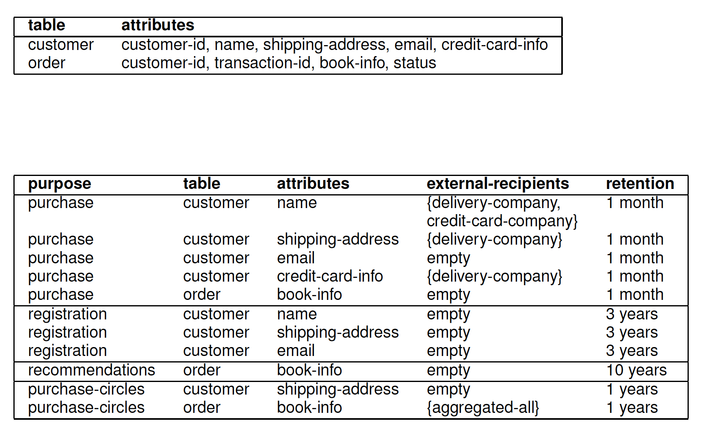
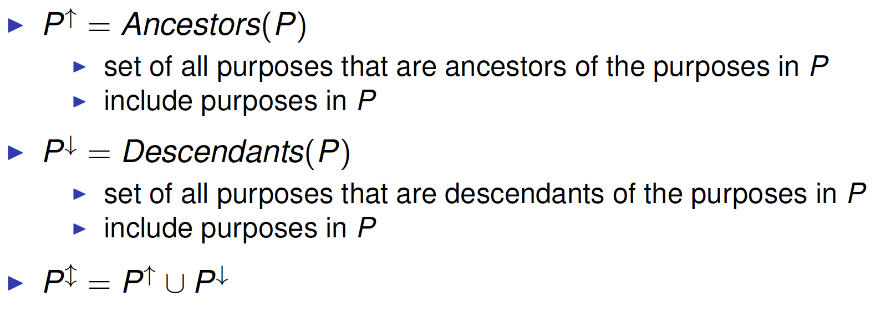
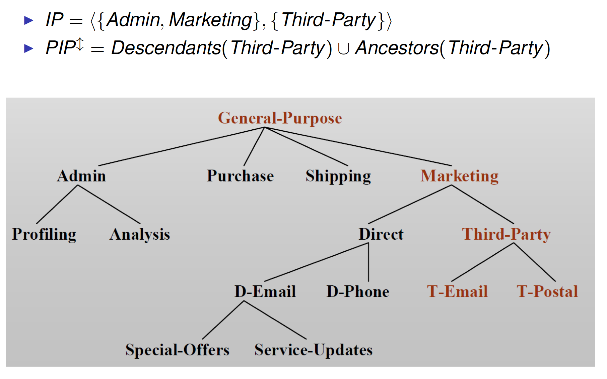
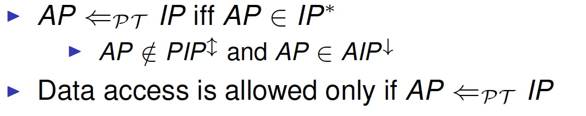
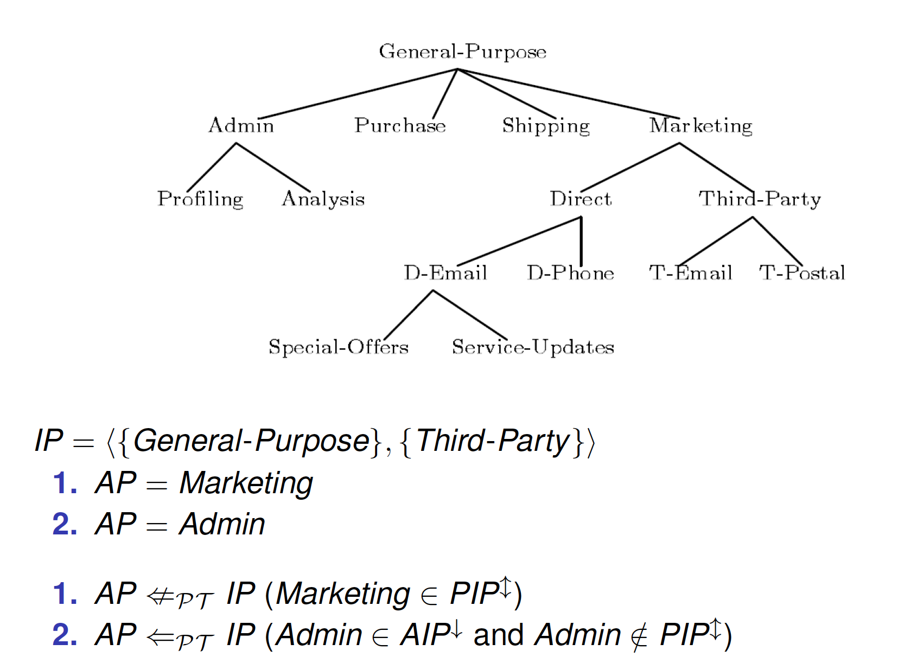
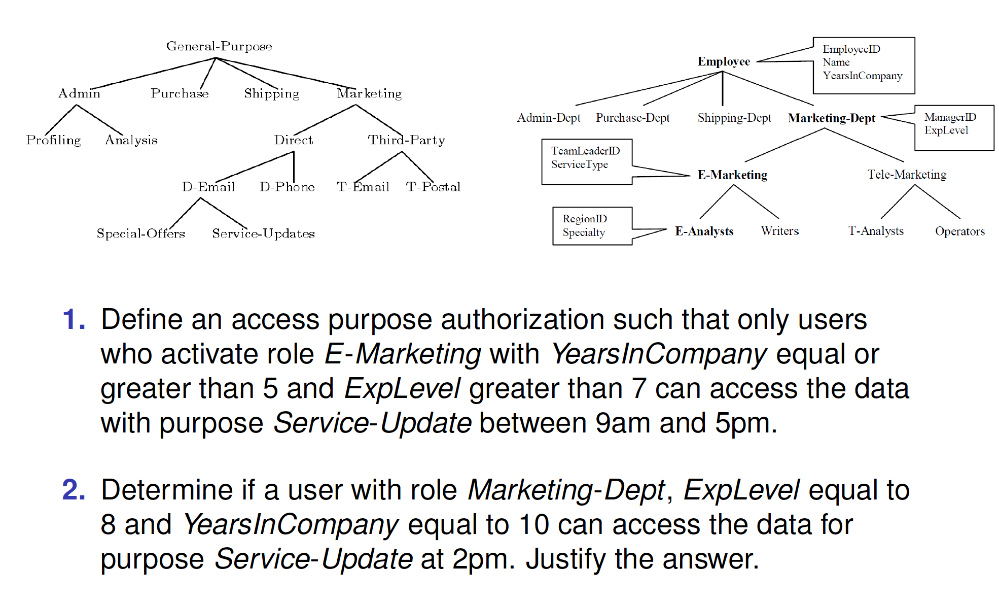

# Privacy-aware Access Control Part 1

##Outline

* Privacy-aware Access Control 
* Hippocratic Databases (Agrawal, 2002) 
* Purpose-based Access Control (Byun and Li, 2008) 
* Enterprise Privacy Authorization Language (IBM 2003)

##Privacy-aware Access Control

###Privacy

Privacy is an important issue today 

* Individuals wants
  * Information about them protected
* Enterprises need to 
  * Keep their customers feel safe 
  * Obey legal regulations
  * Protect themselves from any legal dispute 
  * Maintain good reputations

###Privacy Regulations

Impose stringent requirements on the collection, processing and disclosure of personal data

* Fair and lawful processing
* Purpose specification
* Consent
* Minimality
* Minimal disclosure
* Information quality
* Data subject’s control
* Sensitivity
* Information security

**Purpose Specification**: Personal data should be collected for specified, lawful and legitimate purposes and not processed in ways that are incompatible with the purposes for which data have been collected.

###Beyond Access Control

Traditional access controls focus on which users perform which actions on which data objects 

Privacy is more than confidentiality and integrity of data 

Privacy policies are concerned with which data object is used for which purposes

> “We will collect and use customer identifiable information for billingpurposes and to anticipate and resolve problems with your service.”

Notion of purpose must play a major role in access control: Access decisions should be made based on purpose

###Privacy Policy

* Who: user identities or roles 
* What: resources or data
* How: actions
* Why: the reason for which data are processed
* Conditions: under which the access is granted/denied 
* Obligations: mandatory requirements to be fulfilled

####Example

 

###Access control

 

###Usage control

 

###Privacy-Aware Access Control

 

##Hippocratic Databases

**Goal:** Incorporate privacy protection within DB systems

Inspired by the Hippocratic Oath

> “And about whatever I may see or hear in treatment, or even without treatment, in the life of human beings – things that should not ever be blurted out outside – I will remain silent, holding such things to be unutterable.”

Establish a number of guiding principles 

Encompass an architecture that uses privacy metadata 

Use purpose as the central concept

###The 10 Principles

**Purpose Specification**. For personal information stored in the database, the purposes for which the information has been collected shall be associated with the information. 

**Consent.** The purposes associated with personal information shall have the consent of the data subject. 

**Limited Collection.** The personal information shall be limited to the minimum necessary for accomplishing the specified purposes.

**Limited Use.** The database shall run only those queries that are consistent with the purposes for which the information has been collected.

**Limited Disclosure.** The personal information stored in the database shall not be communicated outside the database for purposes other than those for which there is consent from the data subject.

**Limited Retention.** Personal information shall be retained only as long as necessary for the fulfillment of the purposes for which it has been collected.

**Accuracy.** Personal information stored in the database shall be accurate and up-to-date.

**Safety.** Personal information shall be protected by security safeguards against theft and other misappropriations.

**Openness.** A data subject shall be able to access all her information stored in the database. 

**Compliance.** A data subject shall be able to verify compliance with the above principles. Similarly, the database shall be able to address a challenge concerning compliance.

###Privacy Metadata

Purpose associated to each piece of information

For each piece of information collected for that purpose:

* Authorized-users: users who can access this information 
* External-recipients: whom the information can be disclosed to 
* Retention-period: how long the information is stored

**Privacy-policies table**: privacy practices 

**Privacy-authorization table**: access control supporting privacy policy

| table                  | attributes                               |
| ---------------------- | ---------------------------------------- |
| privacy-policies       | purpose, table, attribute, {external-recipients}, retention |
| privacy-authorizations | purpose, table, attribute, {authorized-users} |

####Privacy-policies table

 

####Privacy-authorization table

 

###Data Collection

Matching privacy policy with user preferences

* check whether the privacy policy is acceptable to the user

* if not, database rejects the transaction

Data insertion

* Data inserted with the purpose for which it may be used

###Data Processing

Queries submitted to the database along with their purpose(e.g. SELECT name FROM customer FOR Marketing) 

Before query execution: check privacy-authorizations table for a match on purpose, attribute and user

During query execution: ensure that only records whose purpose attribute includes the query’s purpose will be visible to the query

###Purpose Management

Difficult policy refinement (Minimality) 

* Decompose purposes into sub-purposes and store them in DB 
* No logical relation between purposes

Information relevant and complete wrt purpose? (InformationQuality)

* Purpose P decomposed in P1 and P2 (both needed to fulfill P) 
* Customer allows P1, but not P2 
* Cannot specify alternatives

##Purpose-based Access Control 

###Definition of Purpose

Describe the reason(s) for data collection and processing 

Organized in a tree structure

 

* **Intended Purpose** (IP)
  * Regulate access to data
  * Associated with data
* **Access Purpose (AP)** 
  * Purpose for accessing a particular data item 
  * Associated with access requests

####Intended Purpose(IP)

Associated with data and regulate data processing 

IP = < AIP, PIP > 

* AIP – Allowed Intended Purposes 
  * Data access for purposes in AIP is allowed
  * Translation of user preferences
* PIP – Prohibited Intended Purposes 
  * Data access for purposes in PIP is never allowed
  * Restriction by organizational requirements or privacy laws

####Ancestors and descendants

Given a set of purposes P

 

####Intended Purpose – Entailment

 

 

 

###Purpose Compliance

Intended purposes tell how data should be used 

Access purpose tells how data will be used 

Purpose Compliance:

 

####Exercise
 

###Access Purpose Determination

####Access Purpose – Definition

Access Purpose

* Purpose for accessing a particular data item 
* Associated with each data request (i.e., query) 
* e.g. SELECT name FROM customer FOR Marketing

How do we determine access purposes?

* That is, how does the access control system determine with what purpose a particular user is trying to access a particular data item?

####Access Purpose Determination

Users explicitly state their access purposes in access request 

* Need to trust the users

Register every application or procedure with an access purpose

* Not applicable if they are complex

Dynamically determined from the current context of the systemI

* Difficult to capture all possibilities

####Access Purpose Verification

Users explicitly state the access purpose when querying 

* e.g., SELECT name FROM customer FOR Marketing

Then, the system verifies if the stated access purpose is valid 

* i.e., the system checks if the user is indeed allowed to access data with the stated purpose for a given circumstances

Verification done through roles (RBAC model)

####Role Attributes

Roles organized in hierarchies 

Role attributes

* Every role r is associated with a set of attributes 
  * Defined directly for r
  * inherited from the ancestor roles of r
* When a user is assigned to a role r , the values  for the role attributes of r are specified for the user
* Values of role attributes available to access control system

  

####System Attributes

Characterize the environment of the system 

Defined by system administrators for the application needs 

Available to access control system at all times

####Conditional Roles

 

####Access Purpose Verification

 

####Access Decision

 

####Exercise

 

##Summary

Access control vs. Privacy 

* Protect information from unauthorized access
* No control on how and why information is used 

Privacy-aware access control 

* Extend access control with the notion of purpose 

Hippocratic Databases 

* Metadata for the specification of privacy policy and privacy authorization tables
* No purpose managementI 

Purpose-based access control 

* Purpose management 
* Access purpose determination 
* No purpose control

##Reference

Rakesh Agrawal, Jerry Kiernan, Ramakrishnan Srikant, YirongXu: Hippocratic Databases. VLDB 2002: 143-154 (obligatory)

Ji-Won Byun and Ninghui Li. 2008. Purpose based accesscontrol for privacy protection in relational database systems. TheVLDB Journal 17(4):603-619. 2008. (obligatory)