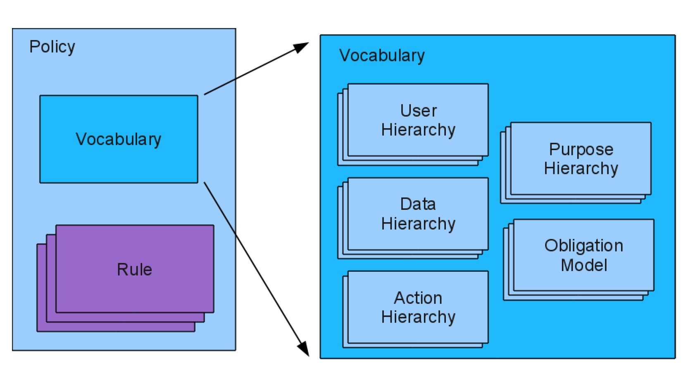
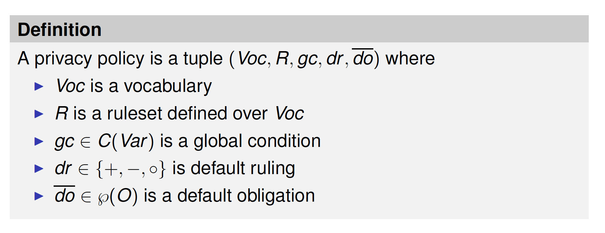
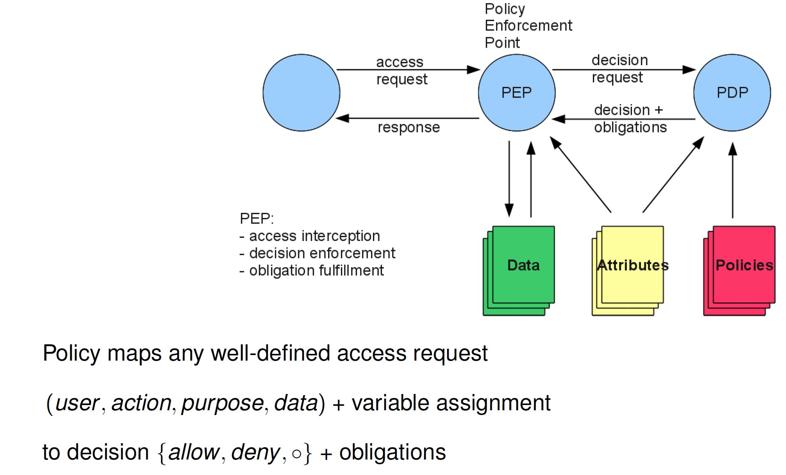
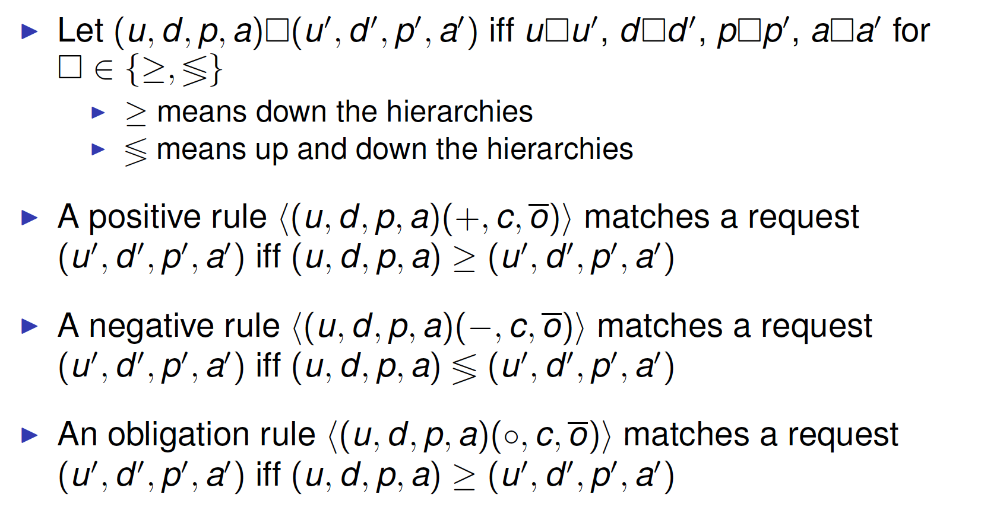
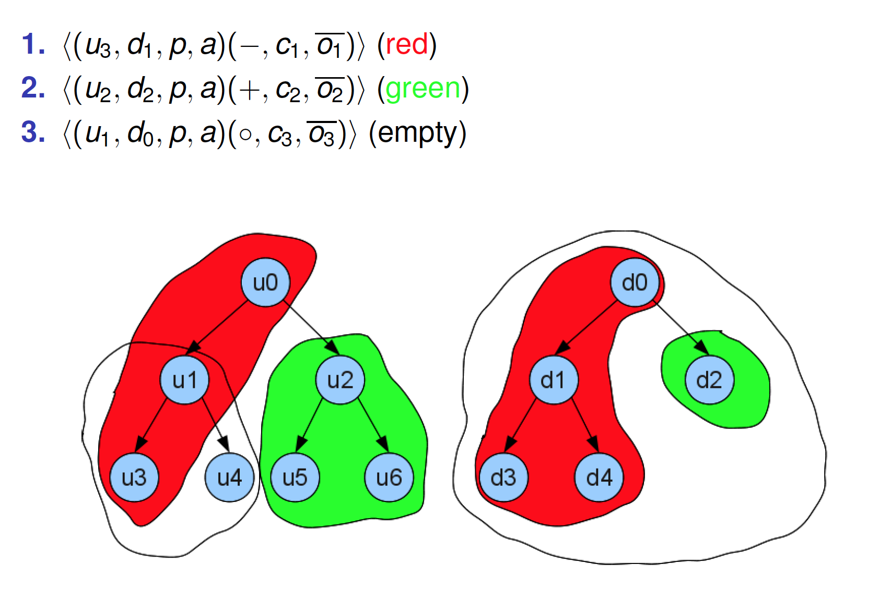
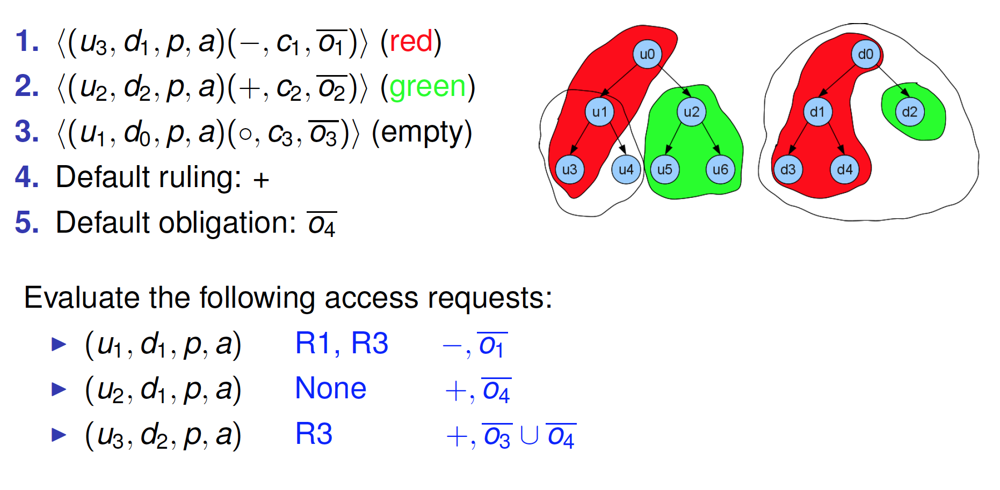
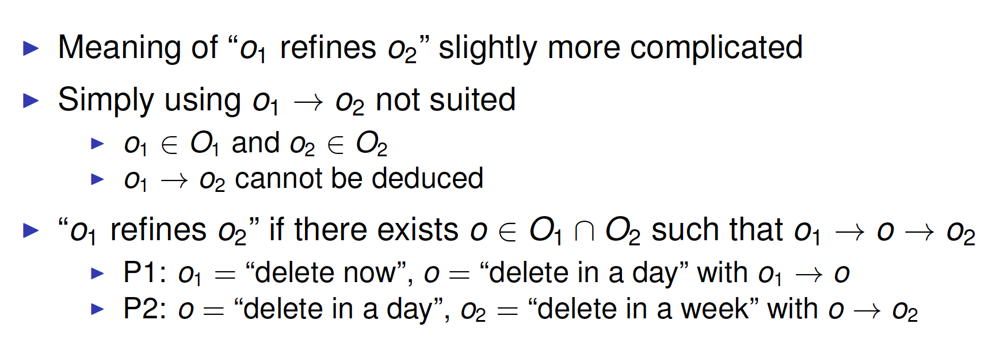
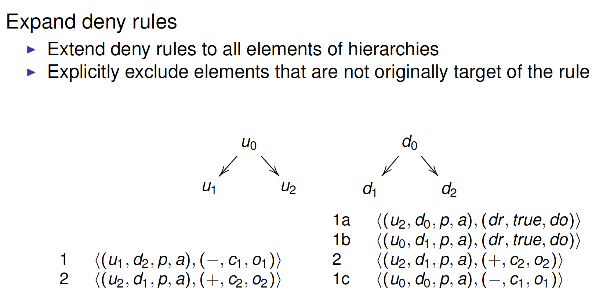
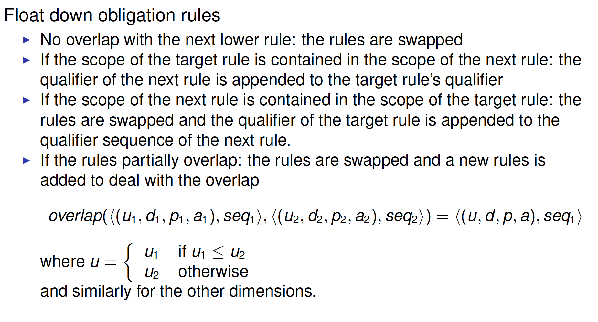
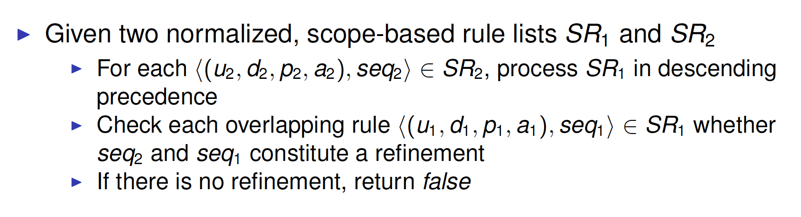

#Privacy-aware Access Control II

##Outline

* Hippocratic Databases (Agrawal, 2002)
* Purpose-based Access Control (Byun and Li, 2008)
* Enterprise Privacy Authorization Language (IBM 2003)
  * Overview
  * Policy Specification
  * Policy Enforcement
  * Policy Management

##EPAL: Overview

Enterprise Privacy Authorization Language 

* Platform for Enterprise Privacy Practices (E-P3P)

Proposed by IBM

Submitted to W3C for standardization (November 2003)

* no action so far

###Privacy Issues in Enterprises

Enterprises store a large amount of personal data

Large enterprises may not know what type of personal data are collected and where they are stored 

Enterprises may not know the consent a customer has given nor the legal regulations that apply to personal data 

Enterprises that process or store data collected by another enterprise are unable to enforce privacy consistently on behalf ofthe collecting enterprise

###Privacy-enabled Data Management

Current situation: 

* Enterprises cannot give privacy guarantees 
* Customers hesitate revealing personal data 
* Legal problems; no business

Enterprises need to 

* Adhere to legal regulations 
* Obtain consent before using personal info 
* Only use data for consented purposes 
* Enable customers to retain control over their data

###EPAL Goals (and Non-Goals)

 

###EPAL Framework

 

##EPAL: Privacy Policy Specification

###Privacy Policies

* Who: user identities or roles 
* What: resources or data
* How: actions
* Why: the reason for which data are processed
* Conditions: under which the access is granted/denied 
* Obligations: mandatory requirements to be fulfilled

###The Sticky Policy Paradigm

Traditional access control 

* “Let’s use the data for marketing!”
* “Wait a second, has the customer giventhe consent?”

Sticky policy paradigm

* “Check if marketing has been consented by the customer...”
* “If not, ask for consent first”

###Enterprise Privacy Policies

 

Data transmitted along with the policy regulating access to it 

EPAL defines policy terminology and authorization rules

Rules allow/deny privacy relevant actions, depending on purpose

###EPAL Policy Model

 

###Hierarchy

Definition:  A hierarchy is a pair (H, >)

* H is a finite set 
*  > ⊆H × H is a transitive, non-reflexive relation

H = {User, Data, Purpose, Action}

User hierarchy

 

employee > manager

employee > clerk

###Obligation Model

 

###EPAL Privacy Policies

**Vocabulary** defines scope of policy:

* Data, users, actions, and purposes as hierarchies
* Obligations as lists

**Ruleset** contains authorization rules:

* A [user] should be [allowed or denied] the ability to perform[action] on [data] for [purpose] under [condition] yielding an[obligation].

* Example: “Email can be used for the book-of-the-month clubif age is more than 13”I

default ruling: **allow, deny, don’t care**

default obligation

global condition

####Vocabulary

A vocabulary is a tuple (UH, DH, PH, AH, Var, OM) 

* UH is a user hierarchy
* DH is a data hierarchy
* PH is a purpose hierarchy
* AH is an action hierarchy
* Var is a conditional vocabulary
* OM is an obligation model

####Ruleset

 

####Privacy Policy

 

####Access request

Definition: A request is a tuple (u, d, p, a) 

* u is a user
* d is a data item
* p is a purpose
* a is an action

Remark: A request is **valid** for a vocabulary Voc if u, d, p, a ∈ Voc

##EPAL: Policy Enforcement

 

###EPAL Semantics

Inheritance 

* Allow inherits down along hierarchies 
* Deny inherits up and down along hierarchies

Processing access request (user, data, purpose, action)

* Check whether there exists applicable rule(s)
  * that cover request directly or by inheritance
  * that satisfies condition(s)

Decision 

* first applicable **allow or deny** rule

###Matching Rules

 

####Example

 

Which rules (if any) apply to the following authorization requests?

* (u1; d1; p; a) R1, R3
* (u2; d1; p; a) None
* (u3; d2; p; a) R3

###Policy Evaluation

Check rules in given order for applicability 

* rule covers request directly/by inheritance
* condition/s are satisfied

Decision

* First applicable deny/allow-rule decides + rule’s obligation(s)

  

####Example

 

##EPAL: Policy Management

Policy refinement

* A policy refines another policy if the first also satisfies the second
* Compliance with legal regulations

Policy composition 

* Notion of constructively combining two policies 
* Provide operators to construct policies

####Policy Refinement

Refinement means adding details to an existing policy while preserving the original privacy statements:

* **Ruling**: Whenever the original policy allows (denies) a request, the refined policy also allows (denies) the request 
* **Obligation**: Fulfillment of the refined obligations implies fulfillmentof the original obligations for every request

#####Policy Refinement: Ruling

What does it mean that r1 refines r2 (r1 < r2) ? 

* If r2 ∈ {deny, allow} then r1 = r2 
  * (weak form also: r2 = allow and r1 = deny)
* If r2 = out-of -scope then r1 can be arbitrary 
* If r2 = don’t care then r1 ∈ {deny, allow, don’t care}

#####Policy Refinement: Obligation

 

#####Exercise: Policy Refinement (1)

 

u5 not covered, + 
Yes
No, consider default ruling.
##### Exercise: Policy Refinement (2)

No, u5 + or -

#####Policy Refinement: Algorithm

Evaluate both policies for any request and any assignment, and compare results 

Not efficient:

* several requests have the same matching rules 
* several condition cannot be satisfied at the same times
* several rules not applicable for particular request and assignment

**Goal**: transform policies to make the comparison easier

Scope based expansion

* ordered list of scope based rules 
* sequence of qualifiers

Normalization of qualifier sequences

* elimination of obligation ruling

Comparison of qualifier sequence 

Comparison of extended rule-lists

See details and example on the paper (see reference at the end)

#####Scope-based expansion

 

 

 

#####Normalization of qualifier sequences

 

#####Comparison

 

##Summary

Access control vs. Privacy 

* Protect information from unauthorized access 
* No control on how information is intended to be used

Privacy-Aware Access Control 

* Access decision based on purpose

Hippocratic Databases

* Metadata for the specification of privacy policy and privacy authorization tables 

Purpose-Based Access Control

* Purpose management
* Access purpose determination

Enterprise Privacy Authorization Language

##References

Michael Backes, Gunter Karjoth, Walid Bagga, and MatthiasSchunter. Efficient comparison of enterprise privacy policies. In Proceedings of the 2004 ACM Symposium on Applied Computing (SAC ’04), 375-382. ACM, 2004. (obligatory)

EPAL 1.2 submission to the W3C 10 Nov 2003. Available at http://www.w3.org/Submission/2003/SUBM-EPAL-20031110/(suggested)

