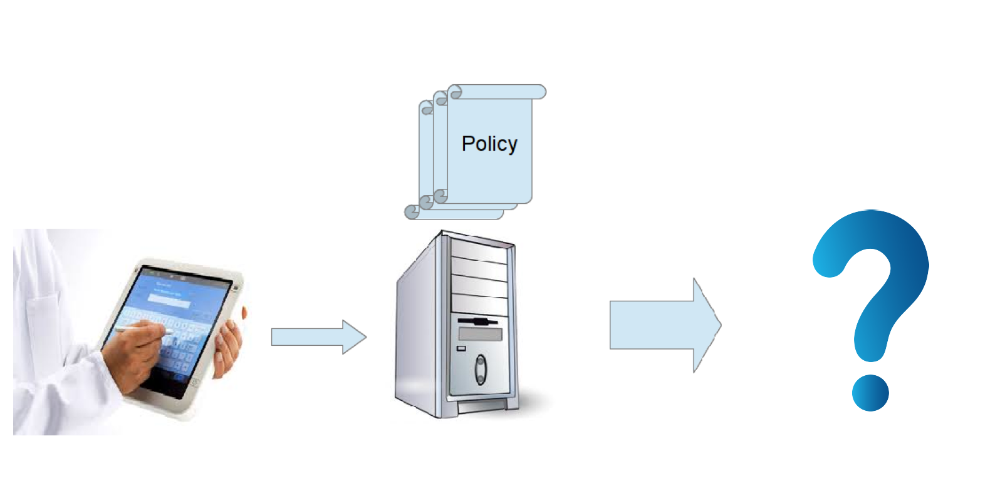
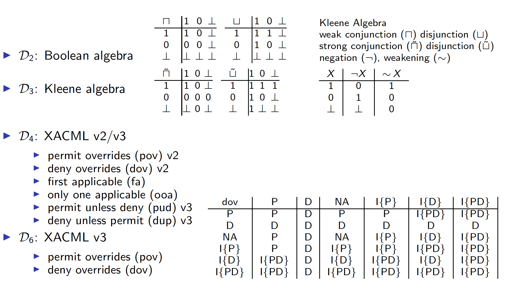
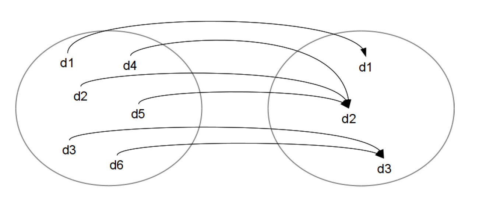
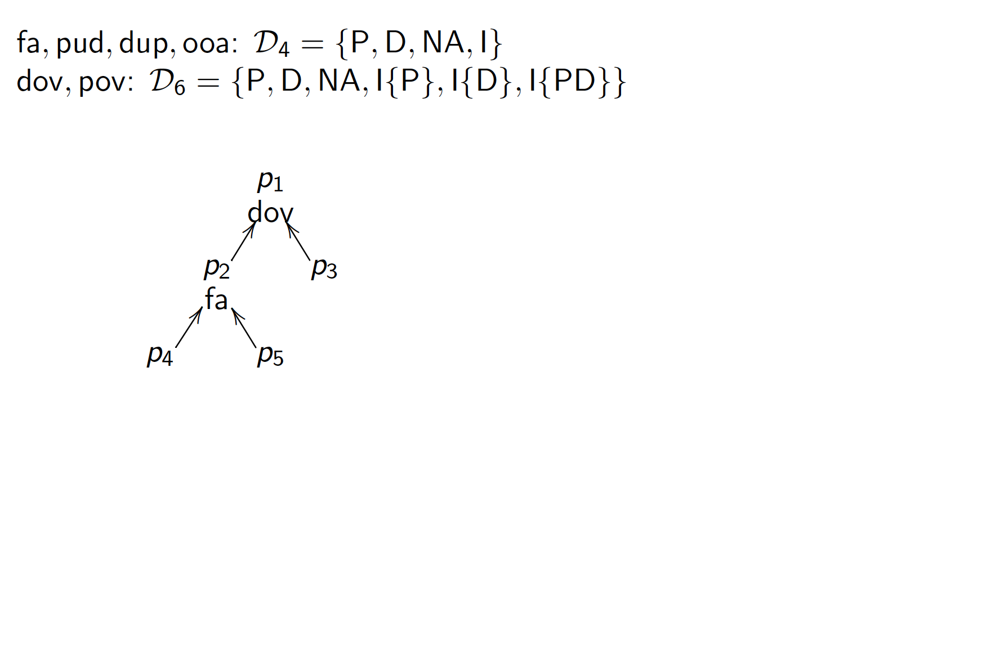
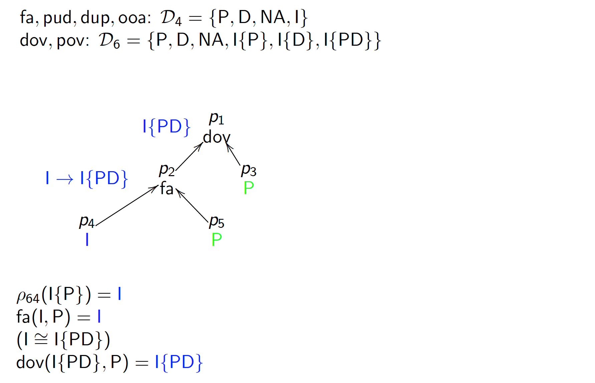
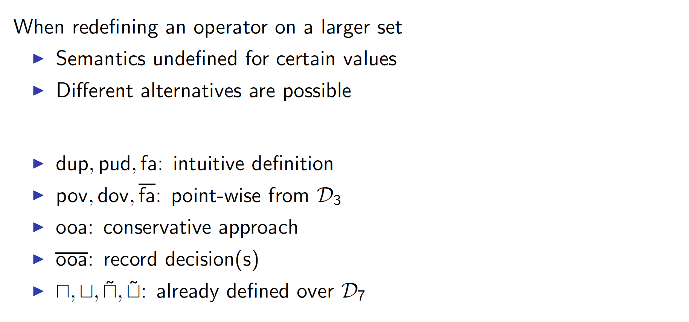
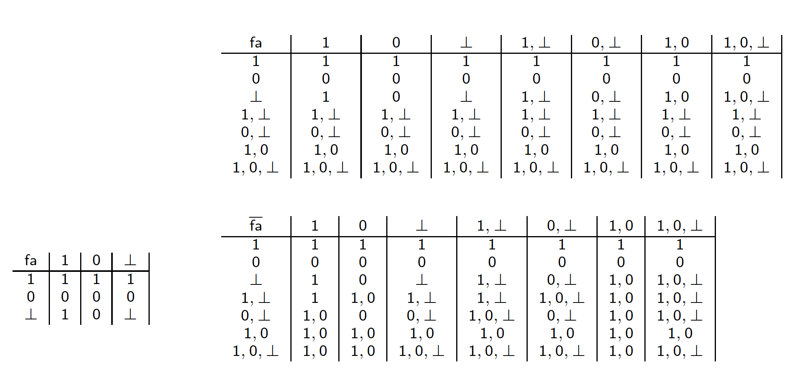

# Reduction of access control decisions

# Reduction of access control decisions

## Outline

Access Decision Sets

Decision Reduction

Safe Reduction

Conclusion

## Access Decision Sets

###Access Control

## Decision Sets

 

## Combining Operators

 

 

#### Exercise

 

## Decision Reduction

### Reducing decision sets

Deal with non-conclusive decisions 

Ensure compatibility of operators when language evolves over time 

* e.g. from XACML v2 to XACML v3 

Reuse operators over smaller decision sets 

Enable interoperability between systems

###Decision Reduction

A **decision reduction** maps a decision set into a smaller decision set by mapping all decisions of a set to decisions of a subset, while leaving the decisions in the subset unchanged

 

###Sample Reduction

 

#### Example

 

Example 1: XACML v3

 

 

 

 

 

 

 

 

 

 

Example 2: From XACML v3 to XACML v2

 

 

Example 3: From PTaCL to XACML v3

 

## Safe Reduction

How to ensure that a reduction can be performed at any level of policy composition without changing the final decision?

 

### Safety of Operator Composition

 

 

### Safety Analysis of XACML v3

 

 

 

### Redefine operators

 

Example: First applicable

 

Example: Only one applicable

 

Safety Analysis of XACML v3 (2,3) .png)

## Conclusion

Decision Reduction

* Deal with non-conclusive decisions
* Reuse combining algorithms
* Enable Interoperability

Safe Decision Reduction

* Ensure that a reduction can be performed at any level of policy composition without changing the final decision

Safety Analysis of XACML v3

* XACML v3 is NOT safe!!
* Decision set depends on combining operators