# Role Based Access Control

# Outline
- Limitation of DAC and MAC
- Role Based Access Control (RBAC)
- Reference Models
  - RBAC0: Core Model
  - RBAC1: Role Hierarchy
  - RBAC2: Constraints
  - RBAC3

## Limitation of DAC and MAC

## Motivations
- Organizations are constantly changing
  - Changes in the organizational structure
  - Users change job function within the organization
- Required **flexible** solution to meet changing needs
- Number of users and applications is increasing within most organizations
- Required **scalable** solution to manage accesses

### Q&A
Suppose you want to add a photo to your wall. How to set permissions in DAC?
- Using capability list: For each user, add permission to view the photo
- Using access control list: List all users that are allowed to view the photo

### Limitation
- Identity-based access control
  - Access control on a per user basis
- Lack of flexibility
- No scalable

## Role Based Access Control (RBAC)

### Beyond Identity-based Access Control
- Access depends on job function, not on identity
  - Example:
    - Bob, bookkeeper for Computer Science Dept, has access to financial records
    - He leaves
    - Bob, bookkeeper for Computer Science Dept, has access to financial records
  - Role of "bookkeeper" dictates() access, not identity of individual
- Idea: associate access rights with job functions within an organization

### Role Based Access Control (RBAC)
**Goals**:
- Describe organizational access control policies
- Based on job function:
  - A user's permissions are determined by her roles
  - rather than by identity or clearance
- Increase flexibility/scalability in policy administration
  - Easy to meet new security requirements
  - Reduce errors in administration
  - Reduce cost of administration

### RBAC:Intuition
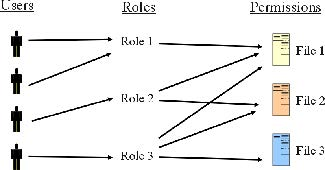

### RBAC
- **Roles** defined based on job function, e.g.,bookkeeper
- **Permissions** defined based on job authority and responsibilities within a role,e.g.,bookkeeper is allowed to read financial records
- **Users** have access to objects based on the assigned role, e.g., Sally is the bookkeeper

### RBAC Security Principles
- **Least privilege**: No more privileges than necessary to perform assigned job
- **Separation of duties**: Pervent users from abusing their position

#### Least Privilege
**Problem**: users can have ability to perform potentially harmful actions as a side effect of granting ability to perform desired functions

**Least Privilege**: User is given no more permission than it is necessary to perform her job function

- Roles engineered based on teh principle of least privilege 
  - Identify user's job functions
  - Determine minimum set of privileges required to perform them
- Users assigned to roles based on their job function
- Users assigned to the same roles have same permissions

#### Separation of duties
**Problem**: users can abuse their position within an organization

**Separation of duties**: Require more than one user to perform critical tasks
- e.g., two distinct clerks are needed to issue a check

### Where RBAC is used
RBAC is currently used in

- Database management systems
- Enterprise Application for Security Administration and User Management

Applicatons(using some form of RBAC)

- Microsoft Active Directory
- Microsoft SQL Server
- IBM Tivoli
- FreeBSD
- Solaris
- Oracle DBMS
- PostgreSQL 8.1

### RBAC:Summary
Simplify definition and administration of access control policies

- Policies based on duty and responsibility of job functions
- Assignment of permissions to users
  - Permissions associated with roles
  - Users assigned to appropriate roles
- Updates for roles instead of updating privileges for every user
  - User changes job function?
  - Add/Remove permission for a job function?

### Four Reference Models
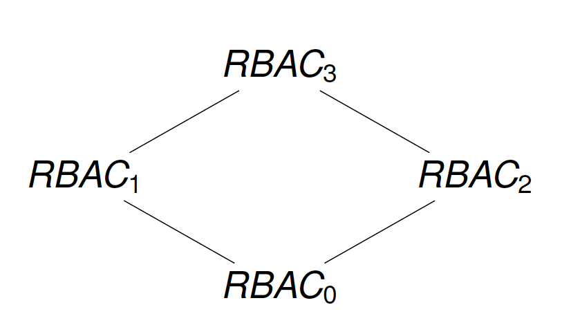
- RBAC0: Core Model
- RBAC1: Role Hierarchy
- RBAC2: Constraints
- RBAC3

## RBAC0 concepts
- **User**
  - a human being or intelligent autonomous agent
- **Role**
  - job function within the context of organization
  - associated semantics regarding its authority and responsibility
- **Permission**
  - an *operation* that can be exercised on *objects*
  - objects and operations are *domain dependent*
- **Session**
  - instance of a connection of a user to the system
  - mapping of users to roles/permissions at a given time
  - define set of activated roles

## RBAC0 Model
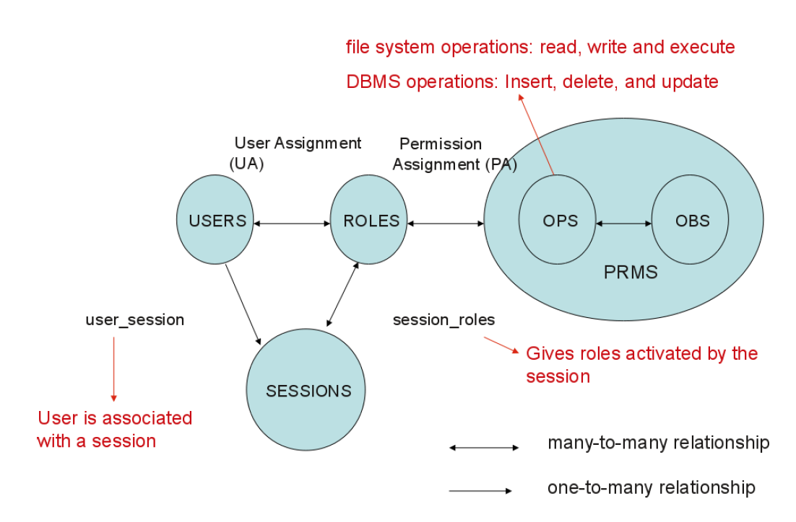
- U Users
- R Roles 
- OPS Operations
- OBS Objects
- P ⊆ OPS × OBS Permissions
- SE Session
- UA ⊆ U × R User Assignment
- PA ⊆ P × R Permission Assignment
- A subject can have multiple roles
- A role can have multiple subjects
- A role can have many permissions
- A permission can be assigned to many roles

### Exercise
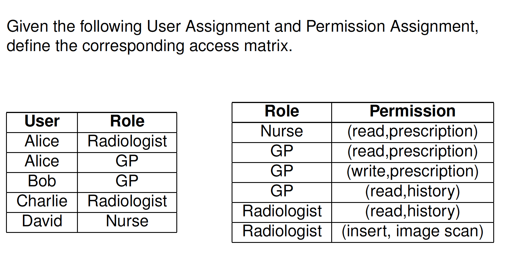

### RBAC1: Role Hierarchy
- Some roles **subsume**(把……归入；把……包括在内) others见36
- This suggests a hierarchy of roles
- Reflect an organizaiton's role structure
- Inheritance among roles
  - Instead of specifying permissions for each role, one specifies it for a more generalized role
  - Granting access to role R implies that access is granted for all specialized roles of R

### Role Hierarchy
- Structuring roles
  - Partial order ≤:x ≤ y we say x is specialization of y
- Inheritance of permission from generalized role y(top) to specialized role x(bottom)
  - Members of x are also implicitly members of y
  - if x ≤ y then role x inherits permissions of role y
- Partial order
  - Reflexivity(i.e., x ≤ x)自反性
  - Transitivity(i.e., x ≤  y and y ≤ z then x ≤ z)传递性
  - Antisymmetry(i.e., x ≤ y and y ≤ x then x= y)反对称性

### Role Hierarchy-Examples

### RBAC1 Model
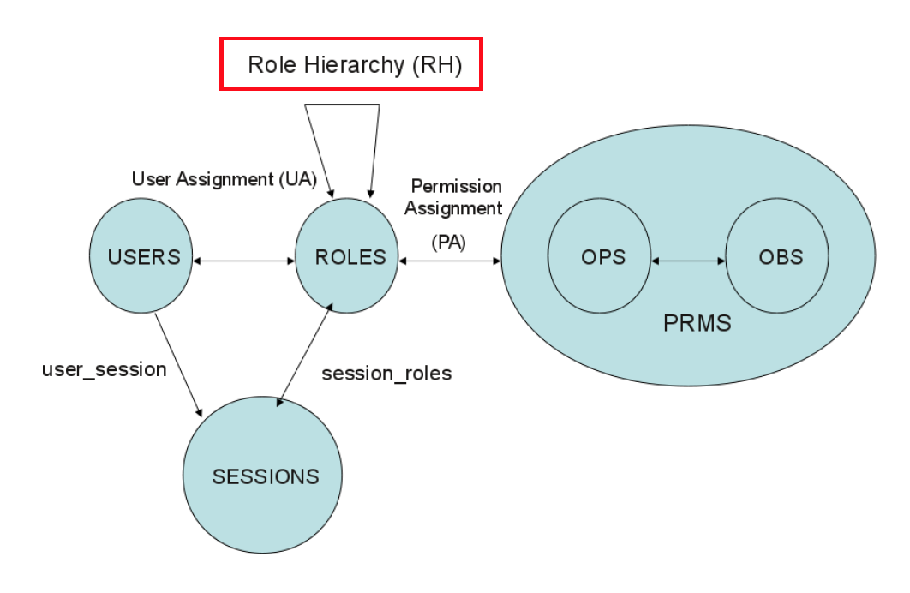

### Exercise 见40-43
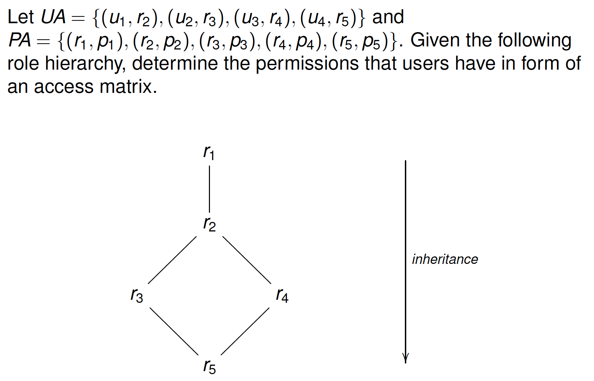

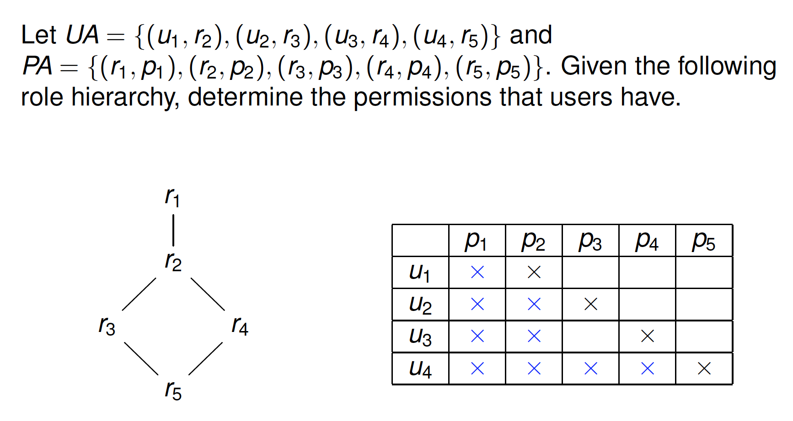
### Remark
- Sometimes, used reversed role hierarchical
- Dominance(优势;支配地位;控制力) relation instead of specialization
- Inheritance from bottom to top
- What is the problem of inheritance with respect to dominance?
  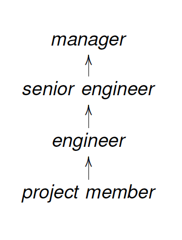

### RBAC2
- Mutually Exclusive Roles
  - Enforce separation of duty
- Cardinality(集的势) constraints
  - Number of users that can be assigned to a role simultaneously
  - Number of roles that a user can have
- Prrequisite roles
  - User can be assigned to role A only if the user is already a member of role B

### Conflicts of Interest
- User gains advantages because
  - Access information about competitors(Chinese Wall)
  - Abuse his position within the organization(RBAC)
- Ensure that two or more users are involved in executing critical operations
- Restrict combinations of privileges made available to users

### Q&A见47-49
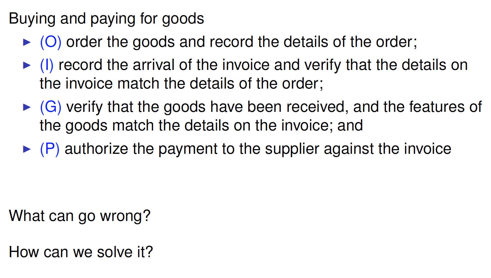

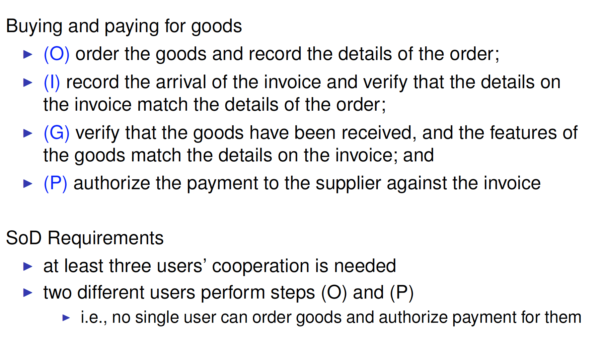

### Separation of Duty
Principle: collaboration of multiple users needed to perform sensitive tasks
- Static Separation of Duty (SSoD): Restrict the permissions that can be **assigned** to a user
- Dynamic Separation of Duty (DSoD): Restrict the permissions that can be **exercised** by a user

#### Static Separation of Duty (SSoD)
Multiple users together should have the permissions to perform sensitive tasks
Static Separation of Duty constraint ssod(ps,n)
- at least n user are needed to cover all permissions in permission set ps

##### In our example.. 见52
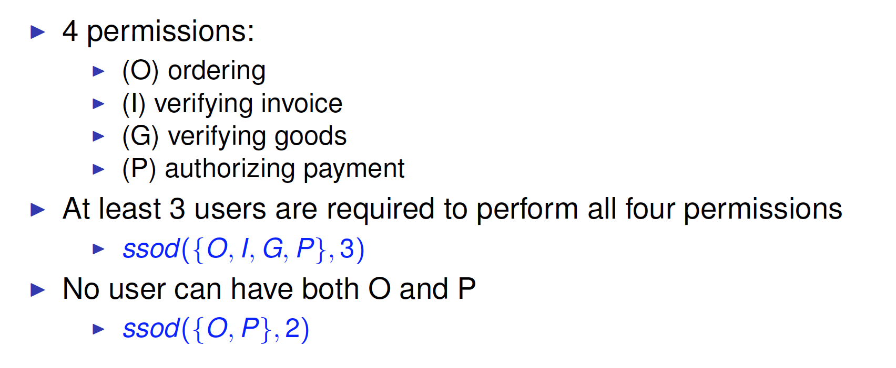

##### Exercise 见54,55
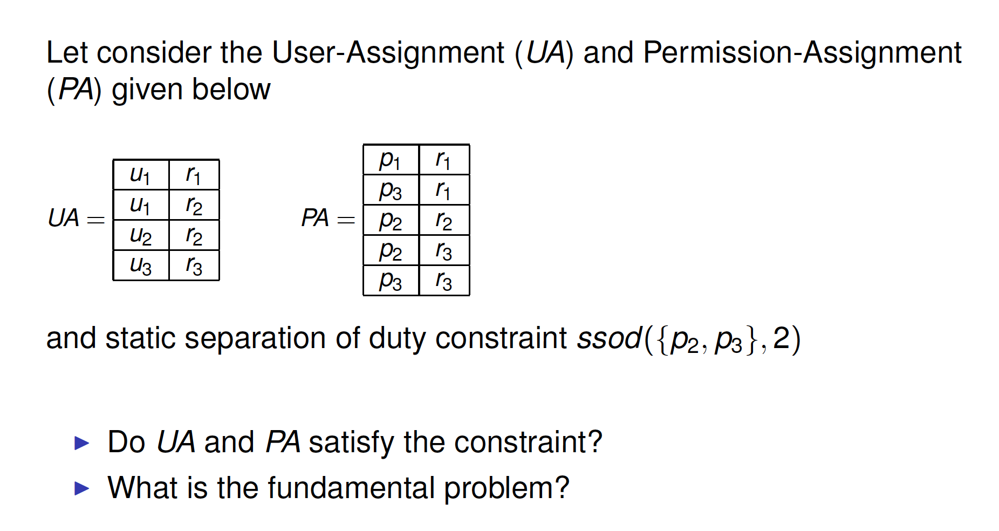
1. inconstraint r3 both p2 and p3
2. ​
#### Static Separation of Duty (SSoD)
- SSoD used to place constrains on permissions assigned to users
- In our example:见56
- SSoD can be too restrictive
- In our example: 见56

#### Dynamic Separation of Duty (DSoD)
Dynamic Separation of Duty
- Object-based Separation of Duty: no user may act upon an object that that user has previously acted upon
- History-based Separatio of Duty: no user is allowed to perform all the actions in a business task on a (collection of) objects

### Mutually Exclusive Roles
Enforcement of separation of duty in RBAC
- Static Mutually Exclusive Roles
  - Static separation of duty
  - Restrictions on the roles that can be assigned to a user
- Dynamic Mutually Exclusive Roles
  - Dynamic separation of duty
  - Restriction on the roles that a user can activate in a session

### Static Mutually Exclusive Roles
Static Mutually Exclusive Roles constraint smer(rs,n)
- Any user cannot be assigned to n or more roles in role set rs

### RBAC2 Model with SMER
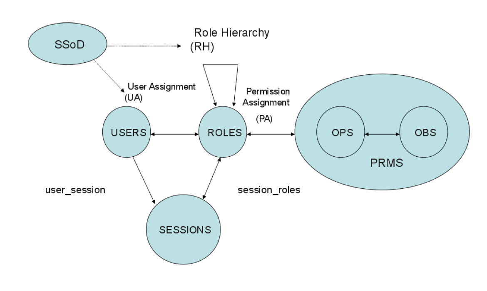

### Exercise 见61-62
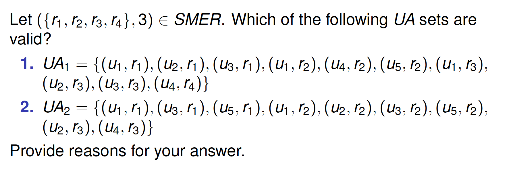

### Dynamic Mutually Exclusive Roles（DMER）
- User can activate multiple roles in one session
- DMER used to restrict role activation
- Dynamic Mutually Exclusive Roles constraint dmer(rs,n)
  - user cannot simultaneously activate n or more roles from role set rs in one session

### RBAC2 Model with DMER
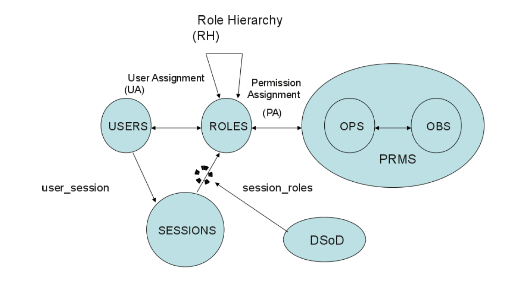
DMER place constraints on the roles that can be activated in a user’s session. If one role that takes part in a DMER is activated, the user cannot activate the related (conflicting) role in the same session

### Other Constraints
- Cardinality constraints on User-Role Assignment
  - At most k users can belong to the role
  - At least K users must belong to the role
  - Exactly k users must belong to the role
- Prerequisite roles
  - Dictate that a user can only be assigned to a particualr role if it is already assigned to some other specified role

### RBAC3
- Consolidated model
- Combine RBAC1 and RBAC2
- Support
  - RBAC0
  - Constraints
  - Role Hierarchies

## Summary
- Limitation of DAC and MAC
  - Lack of flexibility
  - No scalable
- Role Based Access Control (RBAC)
- Reference Models
  - RBAC0: Core Model
  - RBAC1: RBAC0 + Role Hierarchy
  - RBAC2: RBAC0 + Constraints
  - RBAC3: RBAC1 + RBAC2

