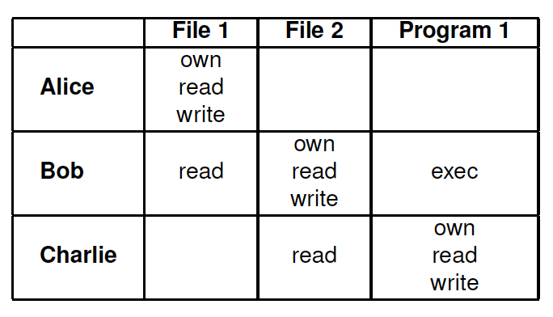

# Usage Control

##Review

###Data Protection Mechanisms

* Access Control
  * Discretionary Access Control (DAC)
  * Mandatory Access Control (MAC)
  * Role-Based Access Control (RBAC)
* Trust ManagementI 
  * access control paradigm for decentralized systems
* Digital Right Management (DRM)

###Access Control

* Identity-based authorization
* Rights pre-defined and granted to subjects
* Repeated access until explicitly revoked
* Access decision at request time
* Enforcement at server side

