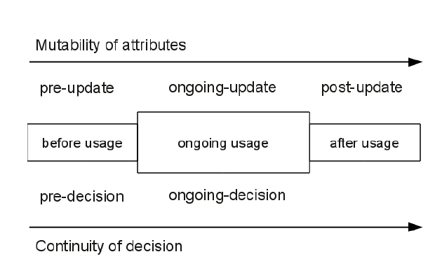
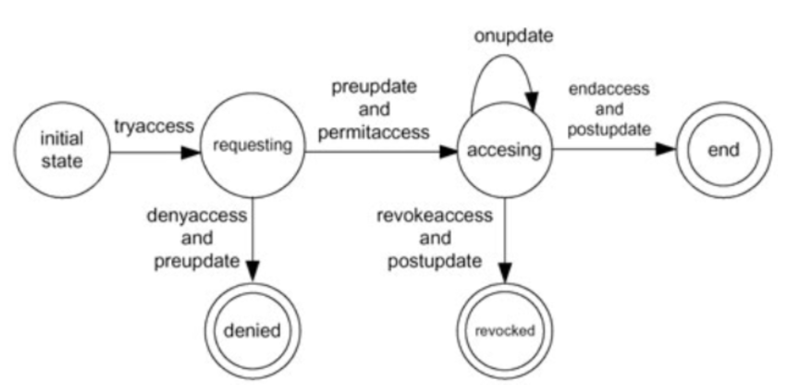
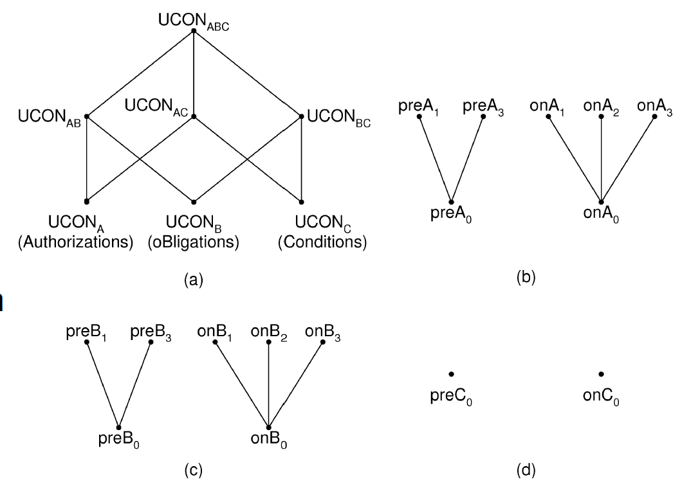
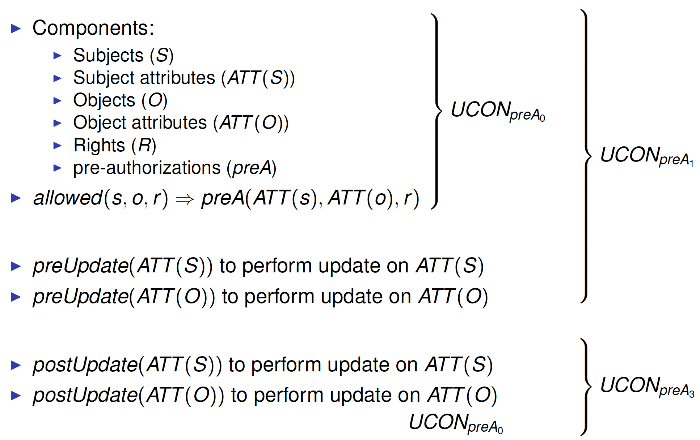
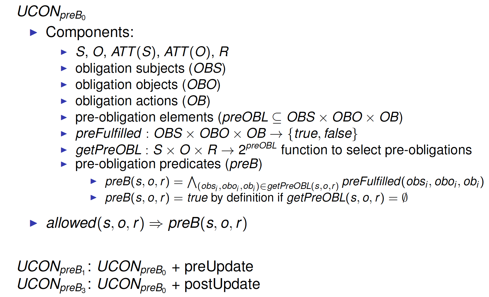
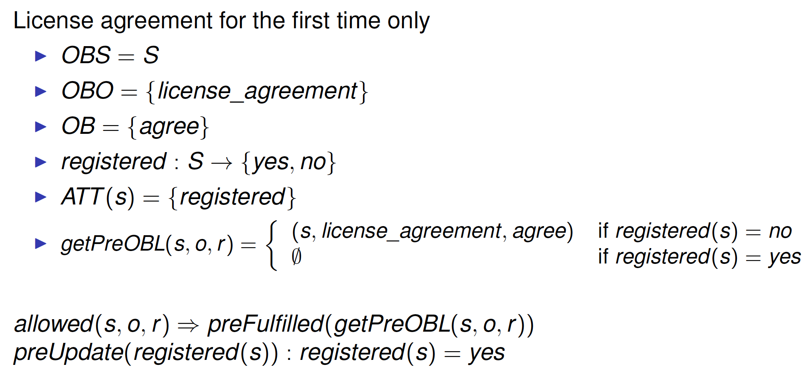
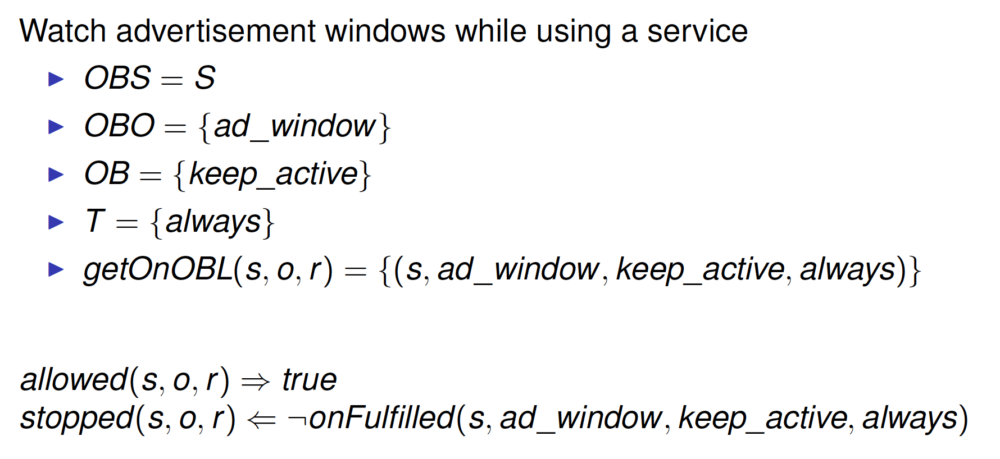

# Usage Control

##Review

###Data Protection Mechanisms

* Access Control
  * Discretionary Access Control (DAC)
  * Mandatory Access Control (MAC)
  * Role-Based Access Control (RBAC)
* Trust Management
  * access control paradigm for decentralized systems
* Digital Right Management (DRM)

###Access Control

* Identity-based authorization
* Rights pre-defined and granted to subjects
* Repeated access until explicitly revoked
* Access decision at request time
* Enforcement at server side

###Trust Management

* Credentials-based authorization
  * Credential: certified attribute of the subject
* Rights pre-defined and granted to subjects
* Repeated access until explicitly revoked
* Access decision at request time
* Enforcement at server side

###Digital Right Management (DRM)

* Control use of digital media
* Focus on intellectual property rights 
* Based on payment functions

* Limit copying, printing, and sharing 
* Prevent unauthorized use of proprietary documents (crypto) 
* Provide evidence of data misuse (digital watermarks) 
* Enforcement at

  * Server side
  * Client side

###Sample policies

* A user can use a service as long he has sufficient credit (servicecost is 10$/hour)

* An MP3 file can be listened at most 3 times

* There can be at most 10 accesses to an object at the same time

* In emergency, any doctor can access patient medical data

###Problems
* Access Control
  * Close system environment
  * No control on already disclosed object
  * No adaptability wrt context
  * No consumable rights
* Trust Management
  * Open system environment
  * No control on already disclosed object
  * No adaptability wrt context
  * No consumable rights
* Digital Right Management (DRM)
  * Lack of access control
  * No adaptability wrt context

##Outline

* Usage Control
* UCONABC

##Usage Control

* Unify(统一) and extend
  * Access Control
  * Trust Management
  * Digital Right Management

* Finer control on usage of digital resources 
  * Attribute-based authorizations
  * Context-aware authorizations
  * Account for evolution
  * Control during the entire lifecycle of usage
    * Before the usage
    * During the usage

* Enforcement at
  * Server side
  * Client side

###Usage Control Coverage

##UCONABC

###UCONABC Model

 

* Decision factors

  * Autorizations
  * Obligations
  * Conditions

    

* Decision properties

  * Continuity(连续性) of decisions
  * Mutability(易变性, 可突变性, 可突变型) of attributes

###Continuity of decisions
* pre-dicision<-access control
  * Decide approval or denial of request
* ongoing-decision
  * Revoke or continue to allow exercise of usage(e.g., user has still credit?)

###Mutability of attributes

Changes as consequence of access

* pre-update: update before usage 
* ongoing-update: update during usage
* post-update: update after usage

####Example

Let consider three payment methods

1. pre-paid credit and cost charged before the use of the service
2. pre-paid credit and cost of the service is 10 cents per min (e.g.,phone call)
3. metered payment

How to model them?

1. pre-update: the credit of the user is checked and (if it is enough)updated before the use of the service.
2. ongoing-update: the credit of the user should be regularly updated (in the example every minute) and the service stopped when the user does not have credit anymore.
3. post-update: the credit is updated after the user used the service(e.g., an invoice is sent at the end of the month).

###UCON Model States

 

###UCONABC Model Components

 

###Subjects (S)

Entities that have rights on objects(e.g., human beings, software agents) 

* Data consumer 
* Data provider
* Data subject (for privacy)

###Subject Attributes (ATT(S))

* Subjects characterized by attributes 
* Properties of a subject used for usage decision(e.g., identity, role, membership, security level)

* **Immutable(不可变的) attributes**:
  * Cannot be modified by user activities 
  * Changed only by administrative activities
  * e.g., security level
* **Mutable attributes**:
  * Modified as a side effect of access 
  * e.g., credit, access time

###Objects (O)

* Resources to be protected 
* Privacy sensitive vs. non-sensitive objects 
* Original vs. derived(派生的) objects 
  * Derived object created in consequence of obtaining/exercising rights on an original object
  * e.g., usage log, payment information

###Object Attributes (ATT(O))

* Objects characterized by attributes
* Properties of the object that can be used for usage decision (e.g., security level, type, value) 
* **Immutable attributes**:
  * Cannot be modified by user activities
  * Changed only by administrative activities
  * e.g., security level, type
* **Mutable attributes**:
  * Modified as a side effect of access
    * e.g., number of times file is played

###Rights (R)

* Subject’s privilege on an object(e.g., read, write, execute)
* Existence of rights determined at usage time
  * Rights can be consumed
  * Access Control: rights predefined in access matrix

###Authorizations (A)

Usage decision based on subject/object attributes and rights

* preA: decision made prior to usage
* onA: decision made during usage

Attribute update

* preUpdate
* onUpdate
* postUpdate

###Obligations (B)

Mandatory requirements a subject has to perform

* preB: check if certain activities have been fulfilled before usage (e.g., a user has to provide some information before accessing a resource)

* onB: to be satisfied continuously during usage (e.g., a user may have to keep watching advertisements while he has logged in)

Attribute update

* preUpdate
* onUpdate
* postUpdate

###Conditions (C)

Evaluate current environmental and system status for usage decision

* preC: condition checked before usage (e.g., a discount is available from 1/1/2011)  
* onC: condition to be satisfied while usage (e.g., object can be used only in a certain location)

Time period (office hour), location (area code, IP address),system status (normal, emergency), etc.

No attribute update

###UCONABC Family

 

Decision factors: authorization, obligations,conditions

Continuity of decision: when decision is made; pre-decision, ongoing-decision

Mutability of attributes: when attributes are updated; never, pre-, ongoing, post

###16 Basic Models

 

Pre-authorization: evaluate before usage 

Pre-obligation: verified before usage 

Conditions: no update attributes

Note: With pre-authorizations it is needed pre-update, for instance to check whether the user has enough credit, and post-update to check whether the user has paid the previous month invoice. Unless the decision is made during usage (i.e, onA and onB), ongoing update is not needed. Indeed, updates can be done at the end as they do not influence the decision (which is made before the use of the service).

###UCONpreA0

Components:

* Subjects (S)
* Subject attributes (ATT(S))
* Objects (O)
* Object attributes (ATT(O))
* Rights (R)
* pre-authorizations (preA)

allowed(s,o,r)⇒preA(ATT(s),ATT(o),r)

* allowed(s,o,r): subject s is allowed to exercise right r on object o 
* ⇒means "implies" (the righthand-side is necessary but not sufficient condition)

###DAC in UCONpreA0

DAC policies using ACL with an individual ID

* N set of identity names
* id : S → N one-to-one mapping between subjects and ID 
* ACL : O → 2N × R
* ATT(S) = {id}
* ATT(O) = {ACL}

allowed(s,o,r)⇒(id(s),r)∈ACL(o)

###Exercise: MAC in UCONpreA0

Define Bell-LaPadula model in UCONpreA0.

* L lattice of security labels with dominance relation ≥
* clearance : S → L
* classification : O → L 
* ATT(S) = {clearance}
* ATT(O) = {classification}

allowed(s,o,read)⇒clearance(s)≥classification(o)

allowed(s,o,write)⇒clearance(s)≤classification(o)

###Semantics

 

###UCONpreA

 

###Example:UCONpreA1

Pay-per-use with a pre-paid credit 

* M amount of money 
* credit : S → M 
* value : O ×  R → M
* ATT(S) = {credit}
* ATT(O) = {value}

allowed(s,o,r)⇒credit(s)≥value(o,r)

preUpdate(credit(s)):credit(s)=credit(s)-value(o,r)

###UCONonA0

Components:

- Subjects (S)
- Subject attributes (ATT(S))
- Objects (O)
- Object attributes (ATT(O))
- Rights (R)
- ongoing-authorizations (onA)

allowed(s,o,r)⇒true

stopped(s,o,r)⇐¬onA(ATT(s),ATT(o),r)

UCONonA1:UCONonA0+preUpdate

UCONonA2:UCONonA0+onUpdate

UCONonA3:UCONonA0+postUpdate

 

###UCONpreB

 

###Example: UCONpreB1 

###UCONonB

 

###Exercise

 

##Summary

* Usage Control 
* UCONABC Model 
  * Decision factors
  * Decision properties
* (some) Basic Models
* Applications

##Reference

Jaehong Park and Ravi Sandhu. 2004. The UCONABC usagecontrol model. ACM Trans. Inf. Syst. Secur. 7, 1, 128-174.(obligatory)!

使用控制模型及其应用的分析与研究. http://m.xuehuile.com/thesis/f21c39dc514e4ab796fdbcdbdfbaf216.html

